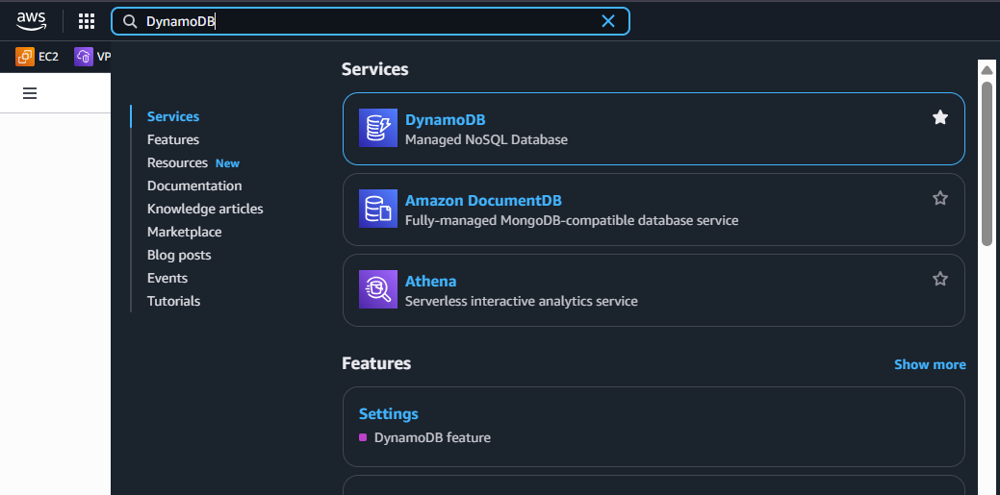
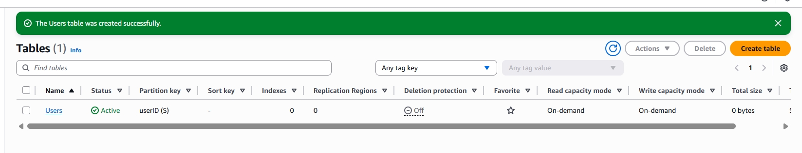

## Create DynamoDB Table
First, we need to create a database to store user information. DynamoDB is the optimal choice for serverless architecture because it can scale automatically and integrates well with Lambda.

In this step, we will create a DynamoDB table named `Users` with Partition key as `userID` (String)

The steps you need to complete for this step are as follows:

1. Go to **DynamoDB Console**
2. Click **Create table**
3. **Table name**: `Users`
4. **Partition key**: `userID` (String)
5. Click **Create table**

Go to **DynamoDB Console**: Access the AWS Management Console and search for DynamoDB.

Click **Create table**: On the DynamoDB page, you will see the "Create table" button in the upper right corner.

Fill in table information: Enter the table name as `Users` and Partition key as `userID` with String data type. Other parameters can be left as default. Finally, click **Create table** to complete.

After creating the table, you will see the `Users` table in your DynamoDB tables list. You can click on the table name to view details and manage data in this table.
