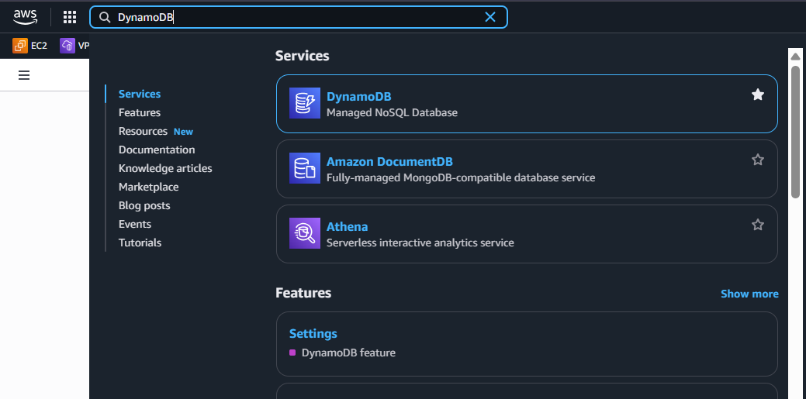
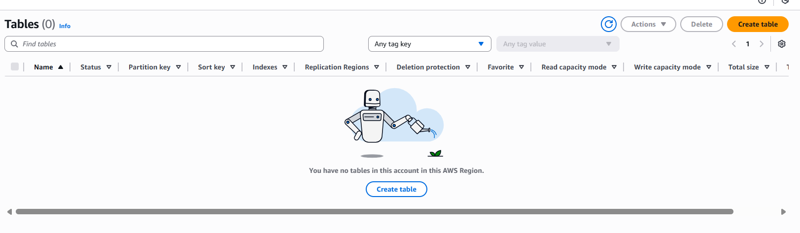
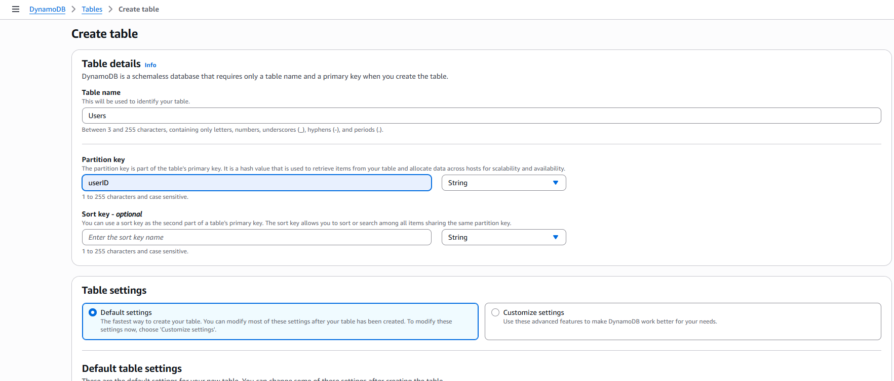
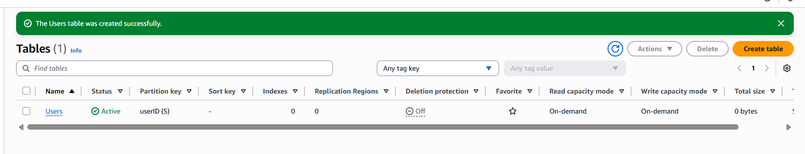

## Tạo DynamoDB Table
Trước tiên, chúng ta cần tạo cơ sở dữ liệu để lưu trữ thông tin người dùng. DynamoDB là lựa chọn tối ưu cho serverless architecture vì nó có khả năng scale tự động và tích hợp tốt với Lambda.

Trong bước này, chúng ta sẽ cần tạo một bảng DynamoDB tên là `Users` , với Partition key là `userID` (String)

Các bước bạn cần hoàn tất bước này sẽ như sau:

1. Vào **DynamoDB Console**
2. Nhấn **Create table**
3. **Table name**: `Users`
4. **Partition key**: `userID` (String)
5. Nhấn **Create table**

Vào **DynamoDB Console**: Truy cập vào AWS Management Console và tìm kiếm DynamoDB.

Nhấn **Create table**: Tại trang DynamoDB, bạn sẽ thấy nút "Create table" ở góc trên bên phải.

Điền thông tin bảng: Nhập tên bảng là `Users` và Partition key là `userID` với kiểu dữ liệu là String. Các thông số khác có thể để mặc định. Cuối cùng, nhấn **Create table** để hoàn tất.

Sau khi tạo bảng, bạn sẽ thấy bảng `Users` trong danh sách các bảng DynamoDB của bạn. Bạn có thể nhấn vào tên bảng để xem chi tiết và quản lý dữ liệu trong bảng này.
