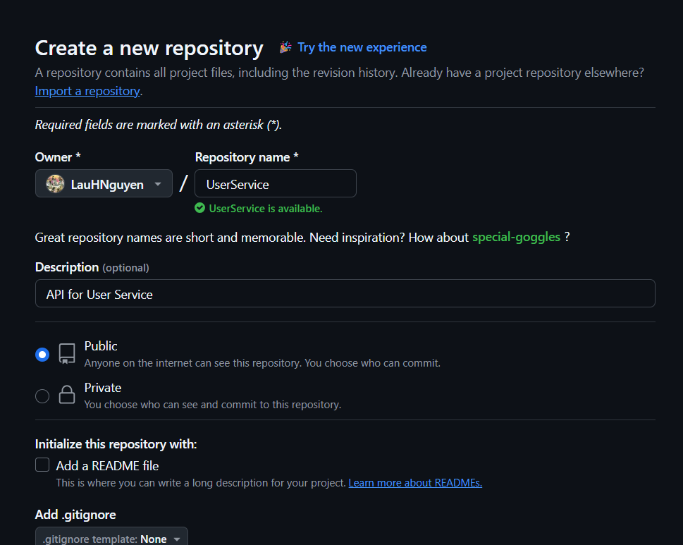
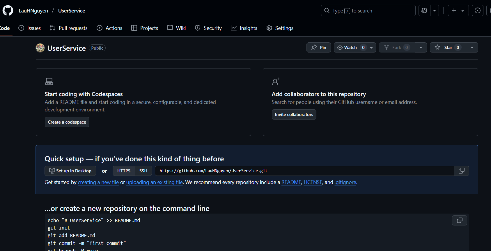
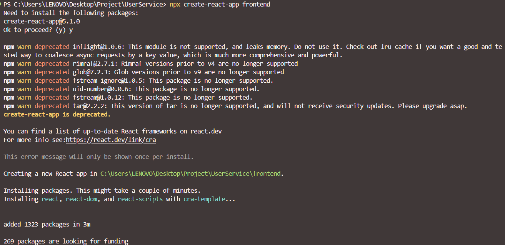
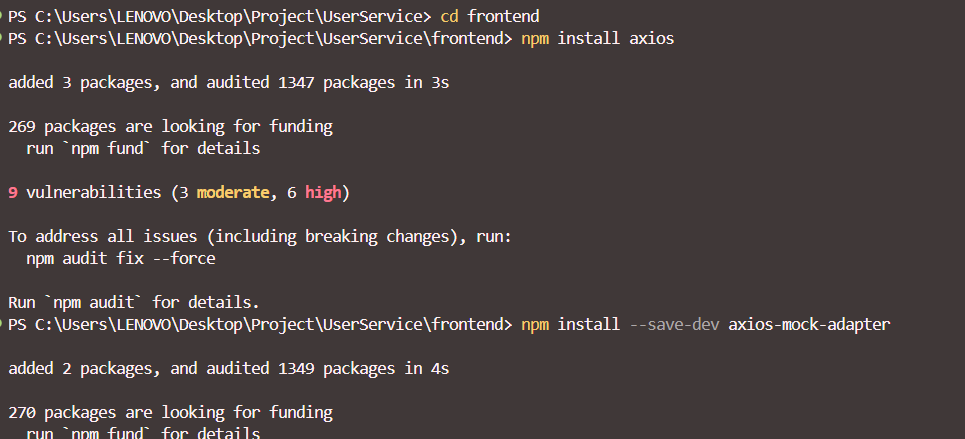
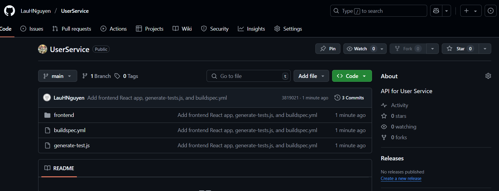

### Create GitHub Repository

In this step, we will create a repository on GitHub to store the source code for our project.

Follow these steps:

1. Go to [GitHub](https://github.com) and log in to your account.
2. Click on the **New** button in the top left corner to create a new repository.
3. Enter the repository information:
   - **Repository name**: `UserService`
   - **Description**: `API for User Service`
   - **Visibility**: Choose `Public` or `Private` depending on your needs.
   - **Initialize this repository with**: Uncheck options like **Add a README file**, **Add .gitignore**, and **Choose a license** to start with an empty repository.
   
4. Click **Create repository** to complete the repository creation.

After creation, you will be redirected to the repository management page. Here, you can add source code, documentation, and configuration for your project.


Clone the repository to your computer to start working with the source code. You can use the following command in the terminal:

```bash
git clone https://github.com/your-username/UserService.git
cd UserService
```

### Create frontend files
To create a simple frontend application, you can use React. You need to install Node.js and npm (Node Package Manager) on your computer before performing this step.
If you haven't installed Node.js, you can download and install it from the [official Node.js website](https://nodejs.org/).
And npm will be installed along with Node.js.
After installing Node.js and npm, you can create a new React application using Create React App, a tool for creating React applications quickly and easily.
To create a React application, you can use the following command in the terminal:

```bash 
npx create-react-app frontend --template typescript
cd frontend
```


It will take a little time for Create React App to create the directory structure and necessary files for your React application.
The directory structure after creation will be as follows:

``` bash
UserService/
└── frontend/
    ├── node_modules/
    ├── public/
    ├── src/
    ├── ...
    ├── package.json
    └── README.md
```
After creating the application, install additional libraries needed for API calls and testing:
```bash
npm install axios
npm install --save-dev jest @testing-library/react @testing-library/jest-dom jest-environment-jsdom
```


Return to the root directory
```bash
cd ..
```

### Create generate-simple-tests.js file
To automatically generate simple Jest test files based on the API created from the OpenAPI specification, you need to create a Node.js script named generate-simple-tests.js in the root directory of the project.

Create the generate-simple-tests.js file in the UserService directory with the following content:

```javascript
const fs = require('fs');
const path = require('path');

// Path to api.ts file
const apiFilePath = path.join(__dirname, 'frontend', 'src', 'api', 'api.ts');

// Path to save test files
const parentDir = path.dirname(path.dirname(apiFilePath));
const outputDir = path.join(parentDir, 'testapi');
if (!fs.existsSync(outputDir)) fs.mkdirSync(outputDir, { recursive: true });

// Read api.ts content
let apiContent;
try {
  apiContent = fs.readFileSync(apiFilePath, 'utf-8');
  console.log('Successfully read api.ts');
} catch (error) {
  console.error('Cannot read api.ts file:', error.message);
  process.exit(1);
}

// Find API methods in api.ts
const methodRegex = /async\\s+(\\w+)\\s*\\([^)]*\\)\\s*:\\s*Promise<[^>]+>/g;
const methods = [];
let match;

while ((match = methodRegex.exec(apiContent)) !== null) {
  methods.push({
    name: match[1],
    fullMatch: match[0]
  });
}

if (methods.length === 0) {
  console.log('No API methods found in api.ts');
  process.exit(1);
}

console.log(`Found ${methods.length} API methods`);

// Map HTTP methods based on method name
function guessHttpMethod(methodName) {
  if (methodName.startsWith('get')) return 'get';
  if (methodName.startsWith('create') || methodName.startsWith('add') || methodName.startsWith('post')) return 'post';
  if (methodName.startsWith('update') || methodName.startsWith('edit') || methodName.startsWith('put')) return 'put';
  if (methodName.startsWith('delete') || methodName.startsWith('remove')) return 'delete';
  if (methodName.startsWith('patch')) return 'patch';
  return 'get'; // Default to GET
}

// Create test file for each API method
methods.forEach(method => {
  const methodName = method.name;
  const httpMethod = guessHttpMethod(methodName);
  const endpoint = `/${methodName.replace(/^(get|create|update|delete|patch)/, '').toLowerCase()}`;
  
  console.log(`Creating test for method: ${methodName}`);
  
  const testCode = `
describe('${httpMethod.toUpperCase()} ${endpoint}', () => {
  it('should call ${methodName} successfully', () => {
    // Simple passing test
    expect(true).toBe(true);
  });
});`.trim();

  const testFilePath = path.join(outputDir, `${methodName}.test.js`); // Using .js instead of .ts
  
  try {
    fs.writeFileSync(testFilePath, testCode);
    console.log(`Created: ${methodName}.test.js`);
  } catch (error) {
    console.error(`Cannot create test file for ${methodName}:`, error.message);
  }
});

console.log('All test files have been created.');
```

### Create buildspec.yml file

The `buildspec.yml` file is a configuration file for AWS CodeBuild that defines the steps needed to build and deploy your application. You need to create this file in the root directory of your repository.

The content of the `buildspec.yml` file is as follows:

```yaml
version: 0.2

cache:
  paths:
    - 'frontend/node_modules/**/*'

phases:
  install:
    runtime-versions:
      nodejs: 18
    commands:
      - echo Installing dependencies...
      - npm install -g @openapitools/openapi-generator-cli
      - cd frontend
      - npm install
      - npm install --save-dev jest @testing-library/react @testing-library/jest-dom jest-environment-jsdom
      - npm install -g jest
      - cd ..

  pre_build:
    commands:
      - echo Writing setupTests.js...
      - mkdir -p frontend/src
      - |
        cat <<EOF > frontend/src/setupTests.js
        // Jest setup file
        // Using require instead of import for compatibility
        require('@testing-library/jest-dom');
        EOF
        
      - echo Writing jest.config.js...
      - |
        cat <<EOF > frontend/jest.config.js
        module.exports = {
          testEnvironment: 'jsdom',
          setupFilesAfterEnv: ['<rootDir>/src/setupTests.js'],
          moduleFileExtensions: ['js', 'jsx', 'ts', 'tsx', 'json'],
          testMatch: ['**/testapi/*.test.js', '**/__tests__/**/*.test.js'],
          collectCoverage: true,
          coverageDirectory: 'coverage',
          testPathIgnorePatterns: ['/node_modules/']
        };
        EOF

      - echo Export OpenAPI spec from API Gateway...
      - aws apigateway get-export --rest-api-id $API_ID --stage-name $STAGE --export-type oas30 --accepts application/json openapi.json
      - |
        if [ ! -f openapi.json ]; then
          echo "Error: Failed to export openapi.json"
          exit 1
        fi

      - echo Generating TypeScript Axios client from OpenAPI spec...
      - openapi-generator-cli generate -i openapi.json -g typescript-axios -o frontend/src/api

      - echo Generating Jest test files from API...
      - node generate-simple-tests.js


  build:
    commands:
      - echo Running frontend tests with coverage...
      - cd frontend
      - CI=true npm test -- --passWithNoTests || echo "Tests failed but continuing build"
      - echo Build frontend app...
      - npm run build
      - cd ..

artifacts:
  files:
    - frontend/build/**/*
    - frontend/coverage/**/*
```

And your directory structure will look like this:
```
UserService/
├── frontend/
│   ├── node_modules/
│   ├── public/
│   ├── src/
│   │   ├── testapi/     (will be created by generate-simple-tests.js)
│   │   ├── api/         (will be created by openapi-generator-cli)
│   │   ├── ...
│   ├── package.json
│   ├── jest.config.js   (will be created during the build process)
│   ├── ...
├── generate-simple-tests.js
└── buildspec.yml
```

Finally, you need to commit and push the changes to GitHub:

```bash
git add .
git commit -m "Add frontend React app, generate-simple-tests.js, and buildspec.yml"
git push origin main
```

After successfully pushing, you can check your repository on GitHub to ensure that the files have been updated correctly.

