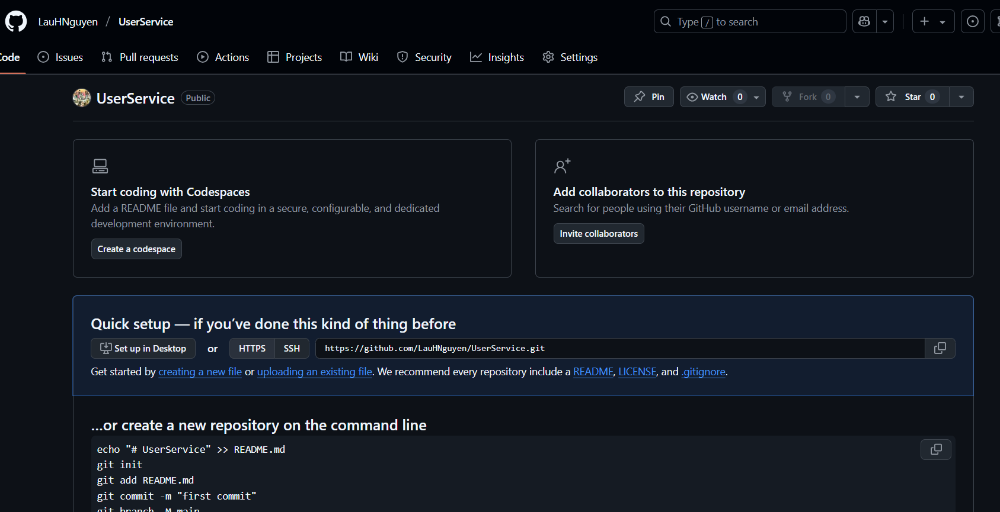
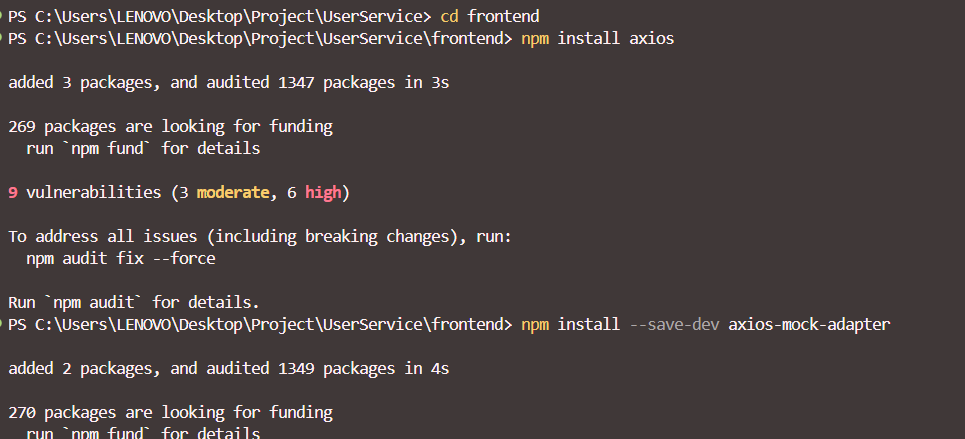
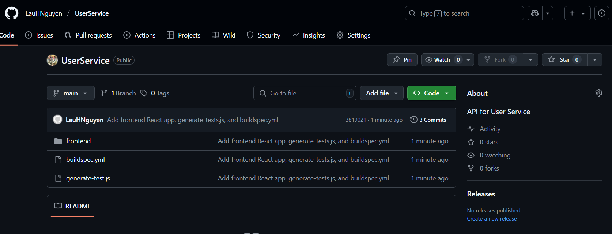

### Tạo GitHub Repository

Trong bước này, chúng ta sẽ tạo một repository trên GitHub để lưu trữ mã nguồn cho dự án của mình.

Các bước bạn cần thực hiện như sau:

1. Truy cập vào [GitHub](https://github.com) và đăng nhập vào tài khoản của bạn.
2. Nhấn vào nút **New** ở góc trên bên trái để tạo một repository mới.
3. Nhập thông tin cho repository:
   - **Repository name**: `UserService`
   - **Description**: `API for User Service`
   - **Visibility**: Chọn `Public` hoặc `Private` tùy thuộc vào nhu cầu của bạn.
   - **Initialize this repository with**: Bỏ chọn các tùy chọn như **Add a README file**, **Add .gitignore**, và **Choose a license** để bắt đầu với một repository trống.
   
4. Nhấn **Create repository** để hoàn tất việc tạo repository.

Sau khi tạo xong, bạn sẽ được chuyển đến trang quản lý của repository. Tại đây, bạn có thể thêm mã nguồn, tài liệu và cấu hình cho dự án của mình.


Clone repository về máy tính của bạn để bắt đầu làm việc với mã nguồn. Bạn có thể sử dụng lệnh sau trong terminal:

```bash
git clone https://github.com/your-username/UserService.git
cd UserService
```

### Tạo file frontend
Để tạo một ứng dụng frontend đơn giản, bạn có thể sử dụng React. Bạn cần cài đặt Node.js và npm (Node Package Manager) trên máy tính của mình trước khi thực hiện bước này.
Nếu bạn chưa cài đặt Node.js, bạn có thể tải xuống và cài đặt từ [trang web chính thức của Node.js](https://nodejs.org/).
Và npm sẽ được cài đặt cùng với Node.js.
Sau khi cài đặt Node.js và npm, bạn có thể tạo một ứng dụng React mới bằng cách sử dụng Create React App, một công cụ tạo ứng dụng React nhanh chóng và dễ dàng.
Để tạo ứng dụng React, bạn có thể sử dụng lệnh sau trong terminal:

```bash 
npx create-react-app frontend --template typescript
cd frontend
```


Sẽ mất một chút thời gian để Create React App tạo ra cấu trúc thư mục và các file cần thiết cho ứng dụng React của bạn.
Cấu trúc thư mục sau khi tạo sẽ như sau:

``` bash
UserService/
└── frontend/
    ├── node_modules/
    ├── public/
    ├── src/
    ├── ...
    ├── package.json
    └── README.md
```
Sau khi tạo ứng dụng, cài đặt thêm các thư viện cần thiết cho việc gọi API và kiểm thử:
```bash
npm install axios
npm install --save-dev jest @testing-library/react @testing-library/jest-dom jest-environment-jsdom
```


Quay lại thư mục gốc
```bash
cd ..
```

### Tạo file generate-simple-tests.js
Để tự động tạo các file test Jest đơn giản dựa trên API được tạo từ OpenAPI specification, bạn cần tạo một script Node.js có tên generate-simple-tests.js trong thư mục gốc của dự án.

Tạo file generate-simple-tests.js trong thư mục UserService với nội dung sau:

```javascript
const fs = require('fs');
const path = require('path');

// Path to api.ts file
const apiFilePath = path.join(__dirname, 'frontend', 'src', 'api', 'api.ts');

// Path to save test files
const parentDir = path.dirname(path.dirname(apiFilePath));
const outputDir = path.join(parentDir, 'testapi');
if (!fs.existsSync(outputDir)) fs.mkdirSync(outputDir, { recursive: true });

// Read api.ts content
let apiContent;
try {
  apiContent = fs.readFileSync(apiFilePath, 'utf-8');
  console.log('Successfully read api.ts');
} catch (error) {
  console.error('Cannot read api.ts file:', error.message);
  process.exit(1);
}

// Find API methods in api.ts
const methodRegex = /async\s+(\w+)\s*\([^)]*\)\s*:\s*Promise<[^>]+>/g;
const methods = [];
let match;

while ((match = methodRegex.exec(apiContent)) !== null) {
  methods.push({
    name: match[1],
    fullMatch: match[0]
  });
}

if (methods.length === 0) {
  console.log('No API methods found in api.ts');
  process.exit(1);
}

console.log(`Found ${methods.length} API methods`);

// Map HTTP methods based on method name
function guessHttpMethod(methodName) {
  if (methodName.startsWith('get')) return 'get';
  if (methodName.startsWith('create') || methodName.startsWith('add') || methodName.startsWith('post')) return 'post';
  if (methodName.startsWith('update') || methodName.startsWith('edit') || methodName.startsWith('put')) return 'put';
  if (methodName.startsWith('delete') || methodName.startsWith('remove')) return 'delete';
  if (methodName.startsWith('patch')) return 'patch';
  return 'get'; // Default to GET
}

// Create test file for each API method
methods.forEach(method => {
  const methodName = method.name;
  const httpMethod = guessHttpMethod(methodName);
  const endpoint = `/${methodName.replace(/^(get|create|update|delete|patch)/, '').toLowerCase()}`;
  
  console.log(`Creating test for method: ${methodName}`);
  
  const testCode = `
describe('${httpMethod.toUpperCase()} ${endpoint}', () => {
  it('should call ${methodName} successfully', () => {
    // Simple passing test
    expect(true).toBe(true);
  });
});`.trim();

  const testFilePath = path.join(outputDir, `${methodName}.test.js`); // Using .js instead of .ts
  
  try {
    fs.writeFileSync(testFilePath, testCode);
    console.log(`Created: ${methodName}.test.js`);
  } catch (error) {
    console.error(`Cannot create test file for ${methodName}:`, error.message);
  }
});

console.log('All test files have been created.');
```

### Tạo file buildspec.yml

File `buildspec.yml` là file cấu hình cho AWS CodeBuild, nó định nghĩa các bước cần thực hiện để xây dựng và triển khai ứng dụng của bạn. Bạn cần tạo file này trong thư mục gốc của repository.

Nội dung của file `buildspec.yml` như sau:

```yaml
version: 0.2

cache:
  paths:
    - 'frontend/node_modules/**/*'

phases:
  install:
    runtime-versions:
      nodejs: 18
    commands:
      - echo Installing dependencies...
      - npm install -g @openapitools/openapi-generator-cli
      - cd frontend
      - npm install
      - npm install --save-dev jest @testing-library/react @testing-library/jest-dom jest-environment-jsdom
      - npm install -g jest
      - cd ..

  pre_build:
    commands:
      - echo Writing setupTests.js...
      - mkdir -p frontend/src
      - |
        cat <<EOF > frontend/src/setupTests.js
        // Jest setup file
        // Using require instead of import for compatibility
        require('@testing-library/jest-dom');
        EOF
        
      - echo Writing jest.config.js...
      - |
        cat <<EOF > frontend/jest.config.js
        module.exports = {
          testEnvironment: 'jsdom',
          setupFilesAfterEnv: ['<rootDir>/src/setupTests.js'],
          moduleFileExtensions: ['js', 'jsx', 'ts', 'tsx', 'json'],
          testMatch: ['**/testapi/*.test.js', '**/__tests__/**/*.test.js'],
          collectCoverage: true,
          coverageDirectory: 'coverage',
          testPathIgnorePatterns: ['/node_modules/']
        };
        EOF

      - echo Export OpenAPI spec from API Gateway...
      - aws apigateway get-export --rest-api-id $API_ID --stage-name $STAGE --export-type oas30 --accepts application/json openapi.json
      - |
        if [ ! -f openapi.json ]; then
          echo "Error: Failed to export openapi.json"
          exit 1
        fi

      - echo Generating TypeScript Axios client from OpenAPI spec...
      - openapi-generator-cli generate -i openapi.json -g typescript-axios -o frontend/src/api

      - echo Generating Jest test files from API...
      - node generate-simple-tests.js


  build:
    commands:
      - echo Running frontend tests with coverage...
      - cd frontend
      - CI=true npm test -- --passWithNoTests || echo "Tests failed but continuing build"
      - echo Build frontend app...
      - npm run build
      - cd ..

artifacts:
  files:
    - frontend/build/**/*
    - frontend/coverage/**/*
```

Và cấu trúc thư mục của bạn sẽ trông như sau:
```
UserService/
├── frontend/
│   ├── node_modules/
│   ├── public/
│   ├── src/
│   │   ├── testapi/     (sẽ được tạo bởi generate-simple-tests.js)
│   │   ├── api/         (sẽ được tạo bởi openapi-generator-cli)
│   │   ├── ...
│   ├── package.json
│   ├── jest.config.js   (sẽ được tạo trong quá trình build)
│   ├── ...
├── generate-simple-tests.js
└── buildspec.yml
```

Cuối cùng, bạn cần commit và push các thay đổi lên GitHub:

```bash
git add .
git commit -m "Add frontend React app, generate-simple-tests.js, and buildspec.yml"
git push origin main
```

Sau khi push thành công, bạn có thể kiểm tra lại repository trên GitHub để đảm bảo rằng các file đã được cập nhật đúng cách.

