In this step, you will create a CodeBuild project to compile your source code. This project will use the `buildspec.yml` configuration file to define the steps to be performed during the compilation process.

### Create CodeBuild Project
1. Go to the **CodeBuild Console**.
2. Click the **Create project** button.
3. Enter a name for your project, for example: `UserServiceBuild`.
4. Select **Source provider** as **GitHub** or **GitHub Enterprise** depending on where your source code is stored.
5. Connect your GitHub account if you haven't done so.
6. Select the repository containing your source code.
7. In the **Environment** section, select **Managed image** and choose the operating system and runtime appropriate for your project, for example: **Ubuntu** and **Standard**.
8. In the **Buildspec** section, select **Use the buildspec.yml file** to use the `buildspec.yml` configuration file already in your repository.
9. In the **Artifacts** section, select **No artifacts** if you don't need to store the build results, or select **Amazon S3** if you want to store the build results in an S3 bucket.
10. Click **Create build project** to complete.

Go to the **CodeBuild Console**: Access the AWS Management Console and search for CodeBuild.
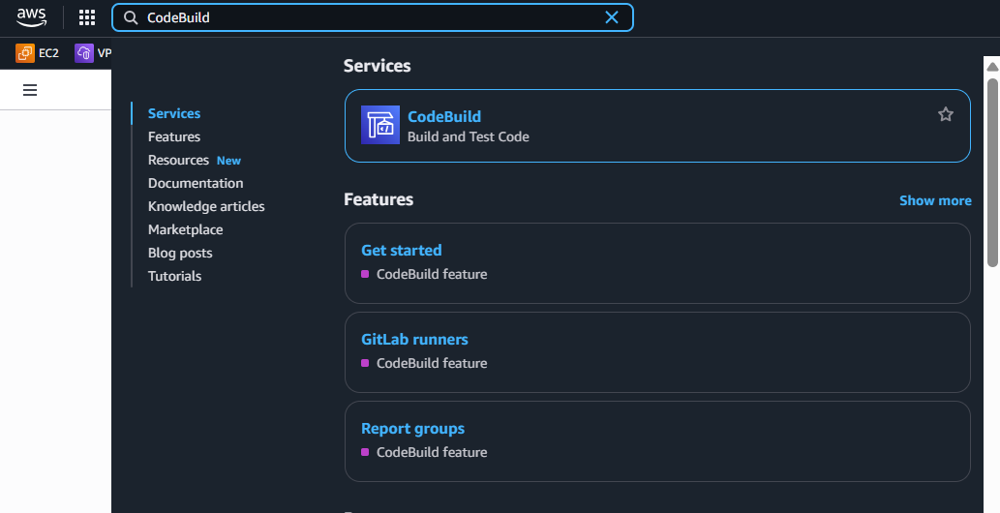

Next, you will see the CodeBuild page. Click **Create project** to start creating a new project.
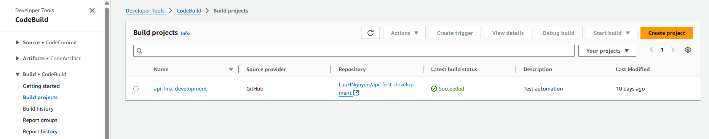

### Configure CodeBuild Project
In the project configuration section, you will need to provide the following information:
- **Project name**: Enter a name for your project, for example: `UserServiceBuild`.
- **Source provider**: Select **GitHub** or **GitHub Enterprise** depending on where your source code is stored.
- **Repository**: Select the repository containing your source code.
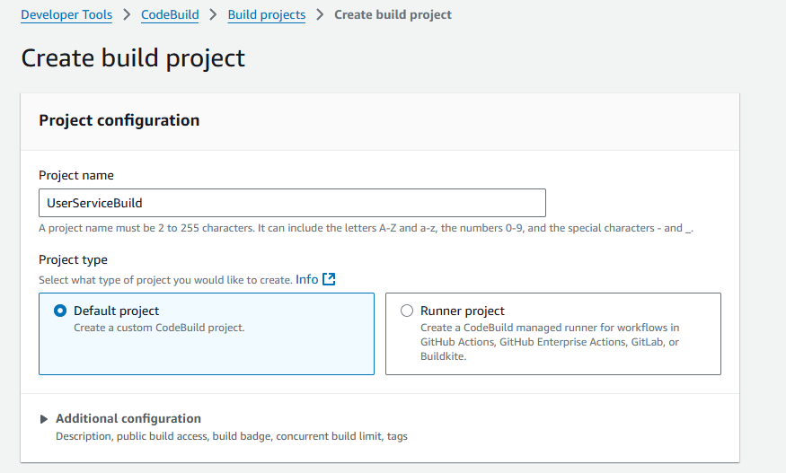
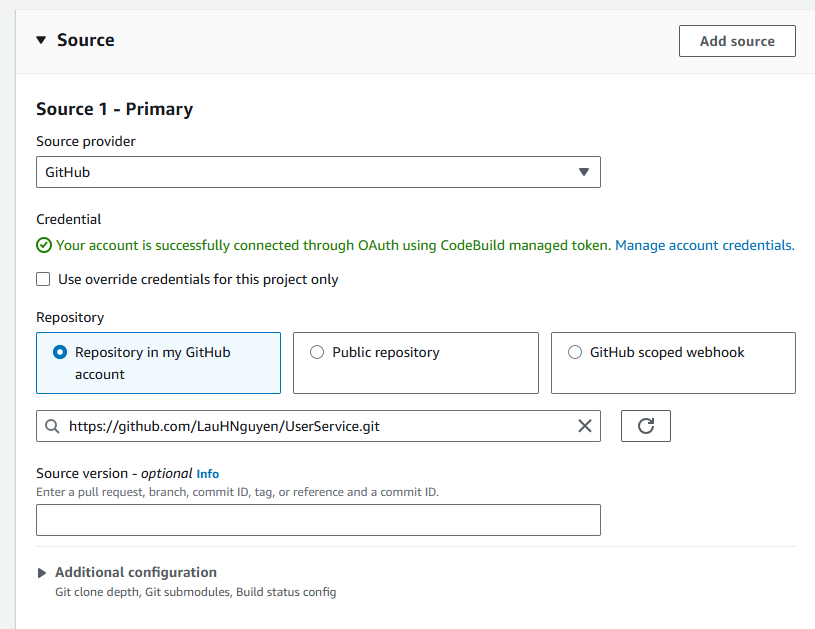

- **Environment**: Select **Managed image** and choose the operating system and runtime appropriate for your project, for example: **Ubuntu** and **Standard**.
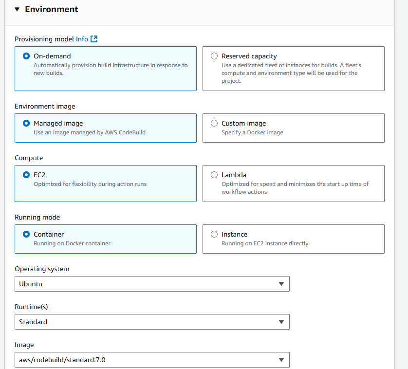
In the **Additional configuration** section of Environment, add the following environment variables:
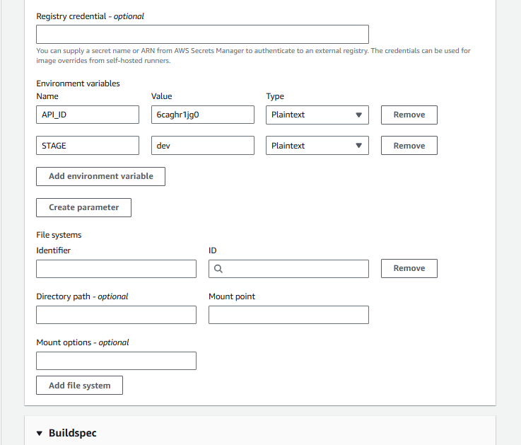

{}
**Note:** Replace API_ID with your API ID,
STAGE is the stage you want to deploy in API Gateway (e.g., "prod" or "dev")
{}

- **Service role**: Select **New service role** to create a new service role for CodeBuild or select an existing role if you have created one before. I will leave it as the default **New service role**.
- **Buildspec**: Select **Use the buildspec.yml file** to use the `buildspec.yml` configuration file already in your repository.
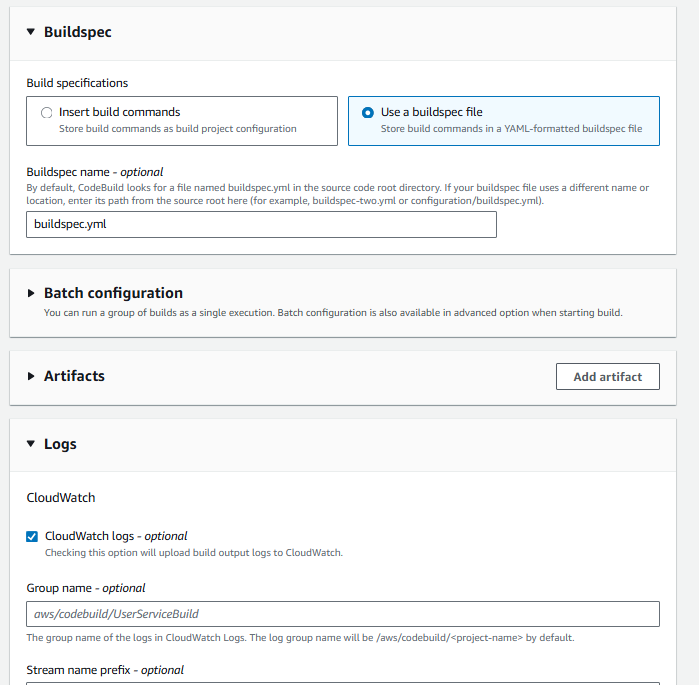
- The remaining sections such as **Artifacts** and **Logs** can be left as default or customized according to your needs. Here I will leave them as default.
- Click **Create build project** to complete the project creation.
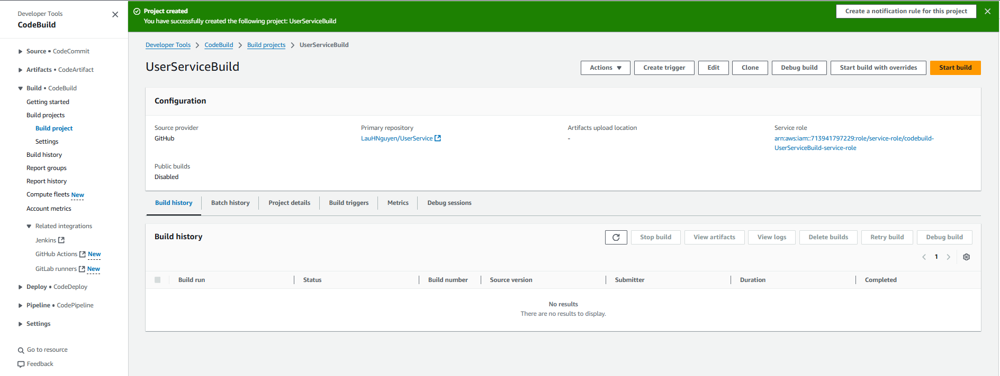

Now you have created a CodeBuild project. Now, you can run this project to compile your source code.

### Add IAM Role for CodeBuild
For CodeBuild to access other AWS services such as S3, API Gateway, you need to grant permissions to the IAM role that CodeBuild uses. You can follow these steps:
1. Go to the **IAM Console**.
2. Select **Roles** from the left menu.
3. Search for the role that CodeBuild created (it usually has a name like `codebuild-<project-name>-service-role`).
4. Click on that role to view its details.
5. In the **Permissions** section, click on **Add permissions** and select **Create policy**.
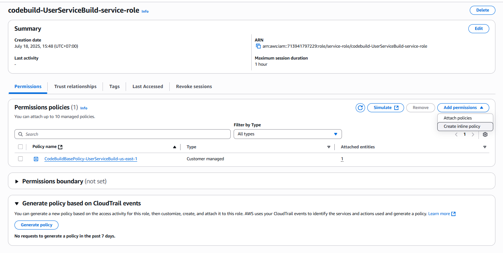
6. Select **JSON** and paste the following code to grant access to S3 and API Gateway:

```json
{
  "Version": "2012-10-17",
  "Statement": [
    {
      "Effect": "Allow",
      "Action": "apigateway:GET",
      "Resource": "arn:aws:apigateway:region-id::/restapis/api-id/stages/stage-name/exports/*"
    },
    {
      "Effect": "Allow",
      "Action": [
        "s3:PutObject",
        "s3:GetObject",
        "s3:ListBucket"
      ],
      "Resource": "arn:aws:s3:::codebuild-[region-id]-[aws-account-id]/*"
    }
  ]
}
```
Here I'm adding access to API Gateway and S3. You need to replace `region-id`, `api-id`, `stage-name`, and `aws-account-id` with your corresponding values.
7. Click **Review policy**, name this policy (e.g., `CodeBuildUserServicePolicy`), and click **Create policy**.
8. Go back to the IAM role you selected, click on **Attach policies** and search for the policy you just created.
9. Select that policy and click **Attach policy** to assign permissions to the role.

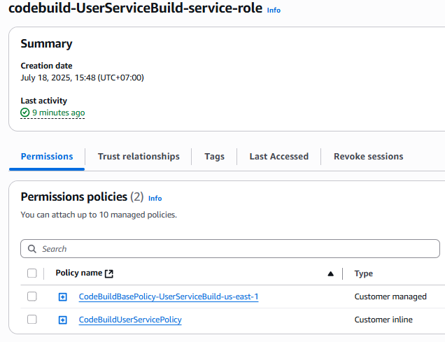

### Run CodeBuild Project
Now that you have created a CodeBuild project and assigned permissions to the IAM role, you can run this project to compile your source code.
1. Go to the **CodeBuild Console**.
2. Select the `UserServiceBuild` project you created.
3. Click the **Start build** button to start the compilation process.
4. You can monitor the compilation process in the **Builds** tab. If the compilation process is successful, you will see the status as **SUCCEEDED**.
This is the CodeBuild interface when you successfully run the project:
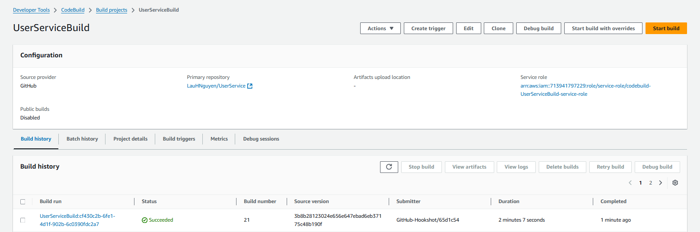