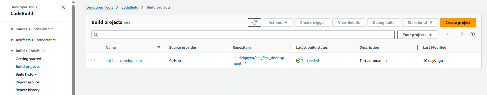
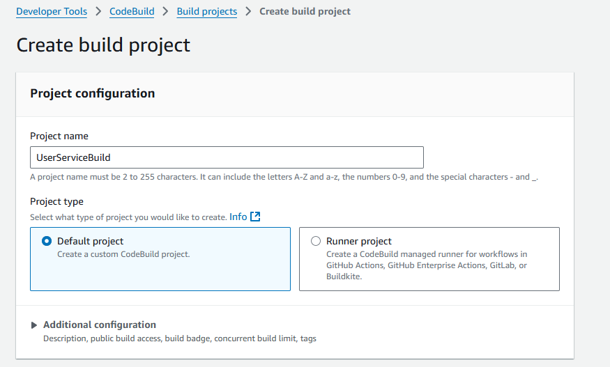
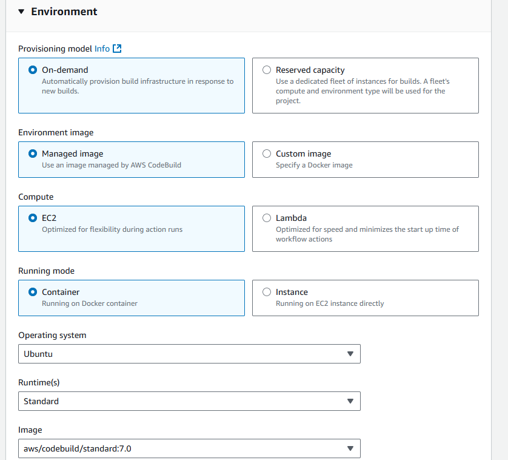
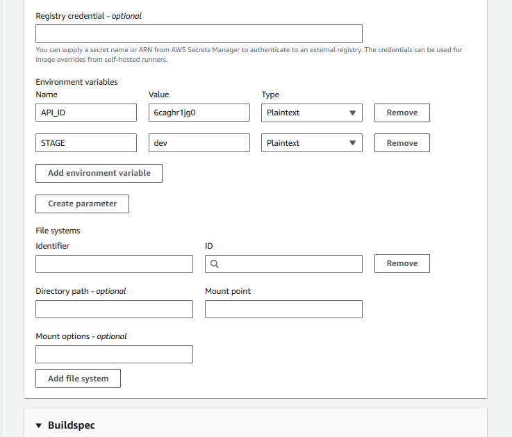
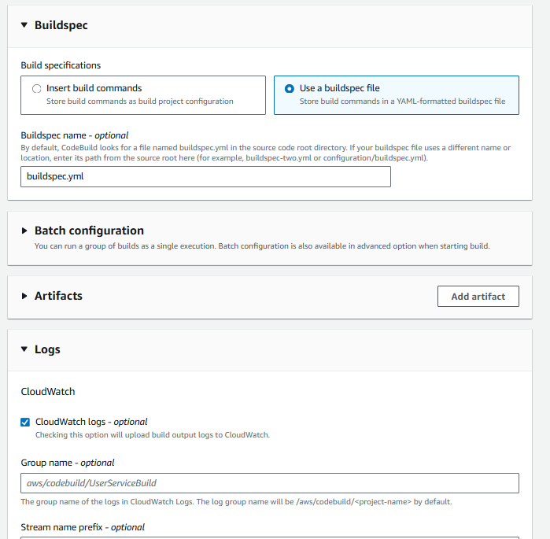
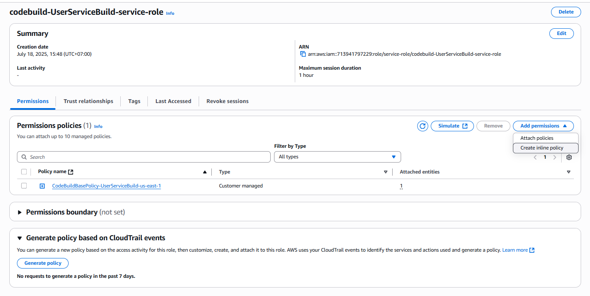
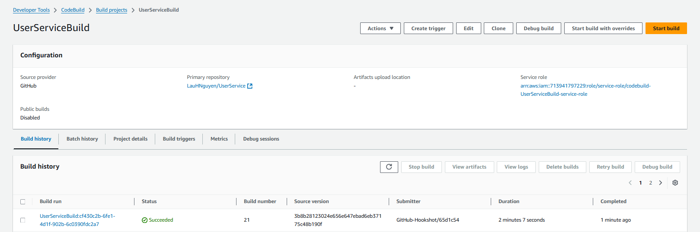

Ở bước này, bạn sẽ tạo một dự án CodeBuild để biên dịch mã nguồn của bạn. Dự án này sẽ sử dụng tệp cấu hình `buildspec.yml` để xác định các bước cần thực hiện trong quá trình biên dịch.

### Tạo dự án CodeBuild
1. Vào **CodeBuild Console**.
2. Nhấp vào nút **Create project**.
3. Nhập tên cho dự án của bạn, ví dụ: `UserServiceBuild`.
4. Chọn **Source provider** là **GitHub** hoặc **GitHub Enterprise** tùy thuộc vào nơi lưu trữ mã nguồn của bạn.
5. Kết nối tài khoản GitHub của bạn nếu chưa làm.
6. Chọn kho lưu trữ chứa mã nguồn của bạn.
7. Trong phần **Environment**, chọn **Managed image** và chọn hệ điều hành và runtime phù hợp với dự án của bạn, ví dụ: **Ubuntu** và **Standard**.
8. Trong phần **Buildspec**, chọn **Use the buildspec.yml file** để sử dụng tệp cấu hình `buildspec.yml` đã có trong kho lưu trữ của bạn.
9. Trong phần **Artifacts**, chọn **No artifacts** nếu bạn không cần lưu trữ kết quả biên dịch, hoặc chọn **Amazon S3** nếu bạn muốn lưu trữ kết quả biên dịch trong một bucket S3.
10. Nhấn **Create build project** để hoàn tất.

Vào **CodeBuild Console**: Truy cập vào AWS Management Console và tìm kiếm CodeBuild.


Tiếp tục, bạn sẽ thấy trang CodeBuild. Nhấn **Create project** để bắt đầu tạo dự án mới.


### Cấu hình dự án CodeBuild
Trong phần cấu hình dự án, bạn sẽ cần cung cấp các thông tin sau:
- **Project name**: Nhập tên cho dự án của bạn, ví dụ: `UserServiceBuild`.
- **Source provider**: Chọn **GitHub** hoặc **GitHub Enterprise** tùy thuộc vào nơi lưu trữ mã nguồn của bạn.
- **Repository**: Chọn kho lưu trữ chứa mã nguồn của bạn.



- **Environment**: Chọn **Managed image** và chọn hệ điều hành và runtime phù hợp với dự án của bạn, ví dụ: **Ubuntu** và **Standard**.

Trong phần **Additional configuration** của Environment, bạn thêm các biến môi trường như sau:


{}
**Chú ý:** Thay API_ID bằng ID API của bạn,
STAGE là giai đoạn bạn muốn triển khai trong API Gateway (ví dụ: "prod" hoặc "dev")
{}

- **Service role**: Chọn **New service role** để tạo một vai trò dịch vụ mới cho CodeBuild hoặc chọn một vai trò đã có nếu bạn đã tạo trước đó. Mình sẽ để mặc định là **New service role**.
- **Buildspec**: Chọn **Use the buildspec.yml file** để sử dụng tệp cấu hình `buildspec.yml` đã có trong kho lưu trữ của bạn.

- Các phần còn lại như **Artifacts** và **Logs** có thể để mặc định hoặc tùy chỉnh theo nhu cầu của bạn. Ở đây mình sẽ để mặc định.
- Nhấn **Create build project** để hoàn tất việc tạo dự án.


Vậy là bạn đã tạo xong dự án CodeBuild. Bây giờ, bạn có thể chạy dự án này để biên dịch mã nguồn của mình.

### Thêm role IAM cho CodeBuild
Để CodeBuild có thể truy cập vào các dịch vụ AWS khác như S3, API Gateway, bạn cần cấp quyền cho vai trò IAM mà CodeBuild sử dụng. Bạn có thể làm theo các bước sau:
1. Vào **IAM Console**.
2. Chọn **Roles** từ menu bên trái.
3. Tìm kiếm vai trò mà CodeBuild đã tạo (nó thường có tên dạng `codebuild-<project-name>-service-role`).
4. Nhấp vào vai trò đó để xem chi tiết.
5. Trong phần **Permissions**, nhấp vào **Add permissions** và chọn **Create policy**.

6. Chọn **JSON** và dán vào đoạn mã sau để cấp quyền truy cập vào S3 và API Gateway:

```json
{
  "Version": "2012-10-17",
  "Statement": [
    {
      "Effect": "Allow",
      "Action": "apigateway:GET",
      "Resource": "arn:aws:apigateway:region-id::/restapis/api-id/stages/stage-name/exports/*"
    },
    {
      "Effect": "Allow",
      "Action": [
        "s3:PutObject",
        "s3:GetObject",
        "s3:ListBucket"
      ],
      "Resource": "arn:aws:s3:::codebuild-[region-id]-[aws-account-id]/*"
    }
  ]
}
```
Ở đây mình thêm quyền truy cập vào API Gateway và S3. Bạn cần thay thế `region-id`, `api-id`, `stage-name`, và `aws-account-id` bằng các giá trị tương ứng của bạn.
7. Nhấn **Review policy**, đặt tên cho policy này (ví dụ: `CodeBuildUserServicePolicy`), và nhấn **Create policy**.
8. Quay lại vai trò IAM mà bạn đã chọn, nhấp vào **Attach policies** và tìm kiếm policy vừa tạo.
9. Chọn policy đó và nhấn **Attach policy** để gán quyền cho vai trò.


### Chạy dự án CodeBuild
Bây giờ bạn đã tạo xong dự án CodeBuild và gán quyền cho vai trò IAM, bạn có thể chạy dự án này để biên dịch mã nguồn của mình.
1. Vào **CodeBuild Console**.
2. Chọn dự án `UserServiceBuild` mà bạn đã tạo.
3. Nhấn nút **Start build** để bắt đầu quá trình biên dịch.
4. Bạn có thể theo dõi quá trình biên dịch trong tab **Builds**. Nếu quá trình biên dịch thành công, bạn sẽ thấy trạng thái là **SUCCEEDED**.
Đây là giao diện của CodeBuild khi bạn chạy thành công dự án:
