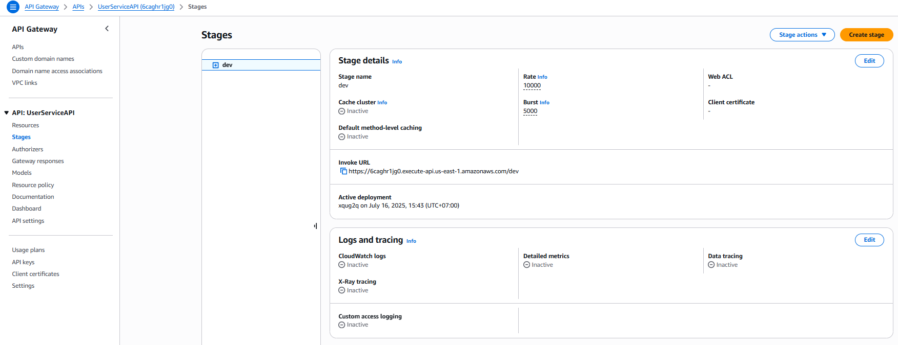
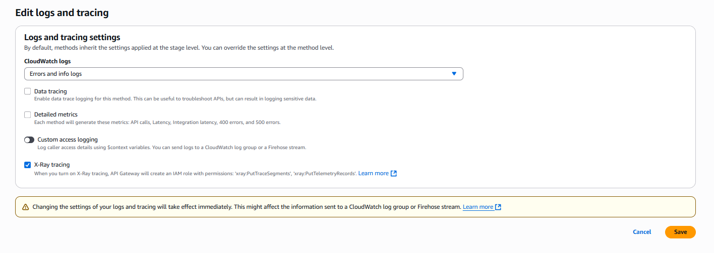
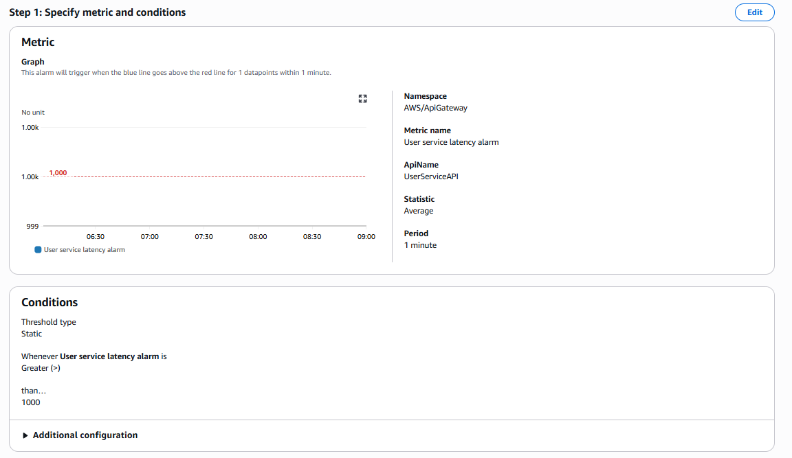
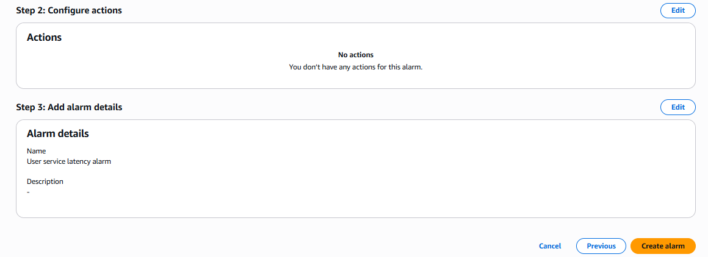
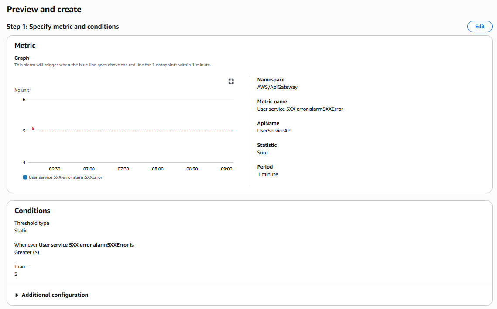

In this step, we will configure API Gateway to log to CloudWatch and enable X-Ray tracing. This will help us monitor API activities and receive detailed information about its performance.

## Set up API Gateway to log to CloudWatch
- Access the AWS Management Console and open the API Gateway service.
- Add a Role to API Gateway to have permission to log to CloudWatch.
Go to the **Settings** section of API Gateway, then select **Edit** in the **CloudWatch Logs** section.

- Select or create an IAM Role with permission to log to CloudWatch. Here I create a new role named `APIGatewayCloudWatchLogsRole` and assign the `AmazonAPIGatewayPushToCloudWatchLogs` policy.
- Select the API you want to configure.
- In the **Stages** section, select the stage you want to enable logging for.
Here, my current stage is "dev", you can choose a different stage if needed.

In the **Logs and tracing** section, click on **edit** to configure.

Here I will only enable the following options:
**CloudWatch Logs**: Errors and Info logs
**X-Ray Tracing**: Enable X-Ray tracing

- Save the changes.

After configuration, API Gateway will start logging to CloudWatch Logs. You can check these logs in the CloudWatch Logs service.

## Set up alarms for API Gateway
- Access the AWS Management Console and open the CloudWatch service.
- In the **Alarms** section, select **Create Alarm**.

- Choose **Select metric** and search for metrics related to API Gateway.
- Select the metrics you want to monitor and click **Select metric**. Choose **API Gateway** then select **By API Name** to view metrics related to your API. Here are the 2 metrics I use to monitor:
  - **Latency**: API response time
  - **5XXError**: Number of 5xx errors (server errors)
since each alarm will monitor one metric, you need to create 2 separate alarms for these 2 metrics.

First, you will create an alarm for the **Latency** metric:
- Select the **Latency** metric and click **Select metric**.
- Name the alarm, for example: "User service latency alarm".
- **Statistic**: Select **Average**.
- **Period**: Select the time period you want to monitor, for example: 1 minute.
- Choose **Threshold type** as **Static**.
- Select **Whenever latency is** and set the threshold for the alarm.
- Set the threshold for the alarm. For example, if you want to receive an alert when the response time exceeds 1 second, you can set the threshold to 1000 ms.

- Select **Next** to continue.
- In the **Configure actions** section, you can choose actions when the alarm is triggered, for example: send email notifications, actions when the alarm is triggered.
- Select **Next** to continue.
- In the **Add name and description** section, you can set a name and description for the alarm. Enter a name for the alarm, for example: `User service latency alarm`.
- Select **Next** to continue.
- In the **Review** section, check the alarm settings and click **Create alarm** to complete.

Similarly, you will create an alarm for the **5XXError** metric:
- Select the **5XXError** metric and click **Select metric**.
- Name the alarm, for example: "User service 5XX error alarm".
- **Statistic**: Select **Sum**.
- **Period**: Select the time period you want to monitor, for example: 1 minute.
- Choose **Threshold type** as **Static**.
- Select **Whenever 5XXError is** and set the threshold for the alarm.
- Set the threshold for the alarm. For example, if you want to receive an alert when the number of 5xx errors exceeds 5 in 1 minute, you can set the threshold to 5.

- Repeat the configuration steps as above to complete creating the alarm for the **5XXError** metric.

After configuration, you will receive notifications when issues occur with API Gateway.

