Ở bước này, chúng ta sẽ cấu hình API Gateway để ghi log vào CloudWatch và bật X-Ray tracing. Việc này sẽ giúp chúng ta theo dõi các hoạt động của API và nhận được thông tin chi tiết về hiệu suất của nó.

## Thiết lập API Gateway để ghi log vào CloudWatch
- Truy cập vào AWS Management Console và mở dịch vụ API Gateway.
- Thêm Role cho API Gateway để có quyền ghi log vào CloudWatch.
Bạn vào phần **Settings** của API Gateway, sau đó chọn **Edit** trong phần **CloudWatch Logs**.
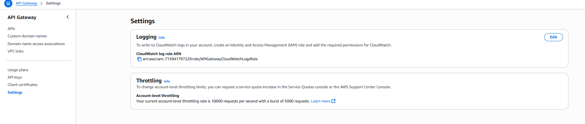

- Chọn hoặc tạo một IAM Role có quyền ghi log vào CloudWatch. Ở đây mình tạo 1 role mới với tên là `APIGatewayCloudWatchLogsRole` và gán policy `AmazonAPIGatewayPushToCloudWatchLogs`.
- Chọn API mà bạn muốn cấu hình.
- Trong phần **Stages**, chọn stage mà bạn muốn bật ghi log.
Ở đây, stage của mình hiện tại là "dev", bạn có thể chọn stage khác nếu cần.

Trong phần **Logs and tracing** bạn nhấn vào **edit** để cấu hình.
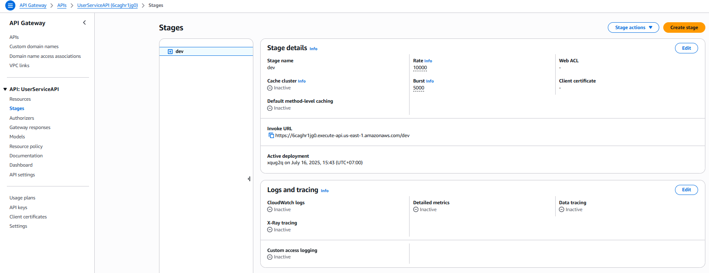

Ở đây mình sẽ chỉ bật các tùy chọn sau:
**CloudWatch Logs**: Errors and Info logs
**X-Ray Tracing**: Bật X-Ray tracing
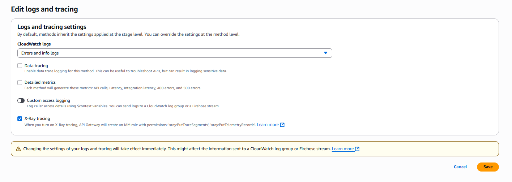
- Lưu các thay đổi.

Sau khi cấu hình xong, API Gateway sẽ bắt đầu ghi lại các log vào CloudWatch Logs. Bạn có thể kiểm tra các log này trong dịch vụ CloudWatch Logs.

## Thiết lập alarms cho API Gateway
- Truy cập vào AWS Management Console và mở dịch vụ CloudWatch.
- Trong phần **Alarms**, chọn **Create Alarm**.
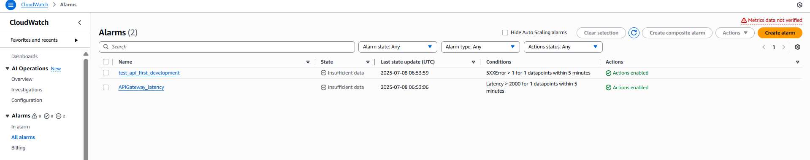
- Chọn **Select metric** và tìm kiếm các metric liên quan đến API Gateway.
- Chọn các metric mà bạn muốn theo dõi và nhấn **Select metric**. Chọn **API Gateway** sau đó chọn **By API Name** để xem các metric liên quan đến API của bạn. Đây là 2 metric mình sử dụng để theo dõi:
  - **Latency**: Thời gian phản hồi của API
  - **5XXError**: Số lượng lỗi 5xx (server errors)
vì mỗi alarm sẽ theo dõi một metric, nên bạn cần tạo 2 alarm riêng biệt cho 2 metric này.
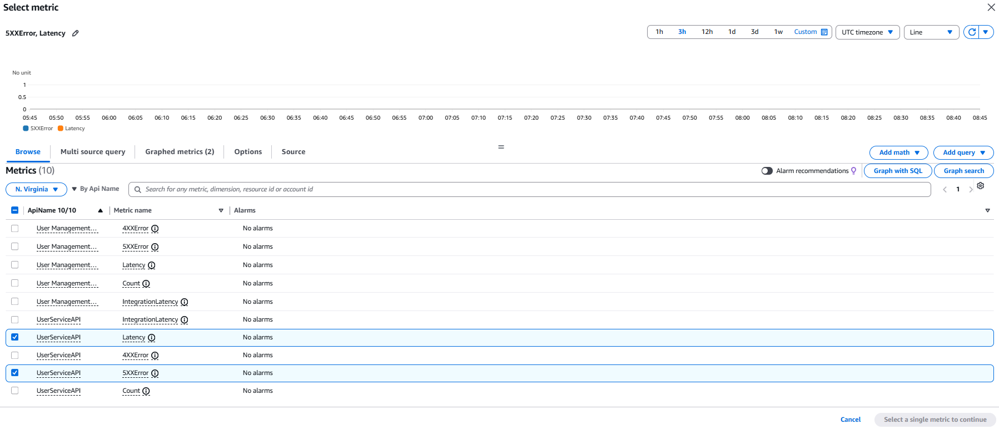

Đầu tiên, bạn sẽ tạo alarm cho metric **Latency**:
- Chọn metric **Latency** và nhấn **Select metric**.
- Đặt tên cho alarm, ví dụ: "User service latency alarm".
- **Statistic**: Chọn **Average**.
- **Period**: Chọn khoảng thời gian mà bạn muốn theo dõi, ví dụ: 1 phút.
- Chọn **Threshold type** là **Static**.
- Chọn **Whenever latency is** và đặt ngưỡng (threshold) cho alarm.
- Thiết lập ngưỡng (threshold) cho alarm. Ví dụ, nếu bạn muốn nhận cảnh báo khi thời gian phản hồi vượt quá 1 giây, bạn có thể đặt ngưỡng là 1000 ms.
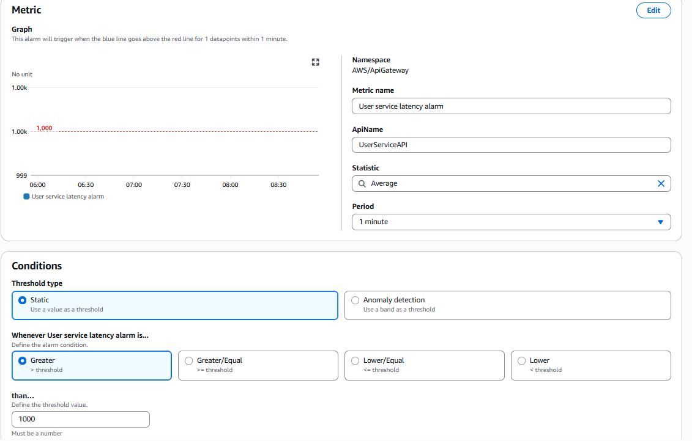
- Chọn **Next** để tiếp tục.
- Trong phần **Configure actions**, bạn có thể chọn các hành động khi alarm được kích hoạt, ví dụ: gửi email thông báo, các hành động khi alarm được kích hoạt.
- Chọn **Next** để tiếp tục.
- Trong phần **Add name and description**, bạn có thể đặt tên và mô tả cho alarm. Nhập tên cho alarm, ví dụ: `User service latency alarm`.
- Chọn **Next** để tiếp tục.
- Trong phần **Review**, kiểm tra lại các thiết lập của alarm và nhấn **Create alarm** để hoàn tất.
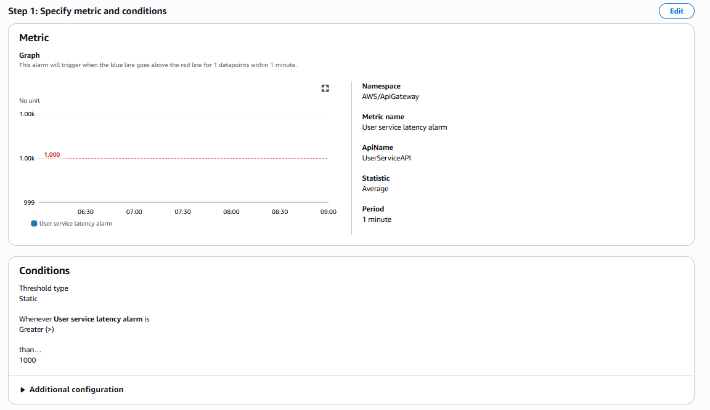
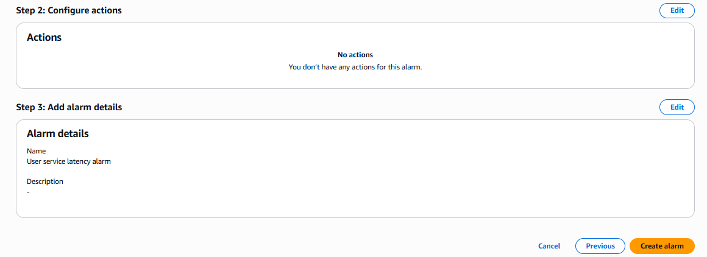

Tương tự, bạn sẽ tạo alarm cho metric **5XXError**:
- Chọn metric **5XXError** và nhấn **Select metric**.
- Đặt tên cho alarm, ví dụ: "User service 5XX error alarm".
- **Statistic**: Chọn **Sum**.
- **Period**: Chọn khoảng thời gian mà bạn muốn theo dõi, ví dụ: 1 phút.
- Chọn **Threshold type** là **Static**.
- Chọn **Whenever 5XXError is** và đặt ngưỡng (threshold) cho alarm.
- Thiết lập ngưỡng (threshold) cho alarm. Ví dụ, nếu bạn muốn nhận cảnh báo khi số lượng lỗi 5xx vượt quá 5 trong 1 phút, bạn có thể đặt ngưỡng là 5.
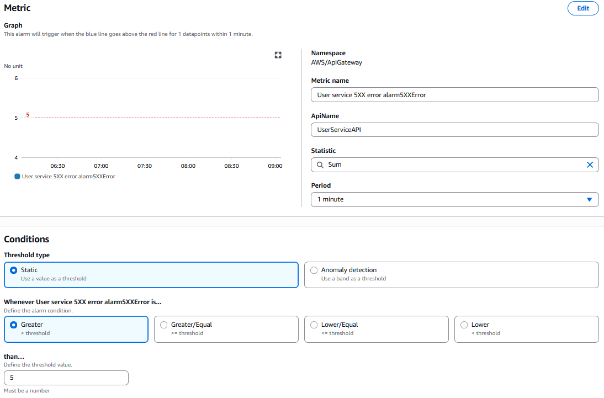
- Lặp lại các bước cấu hình tương tự như trên để hoàn tất việc tạo alarm cho metric **5XXError**.
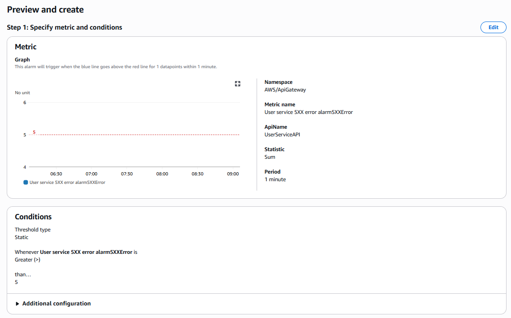
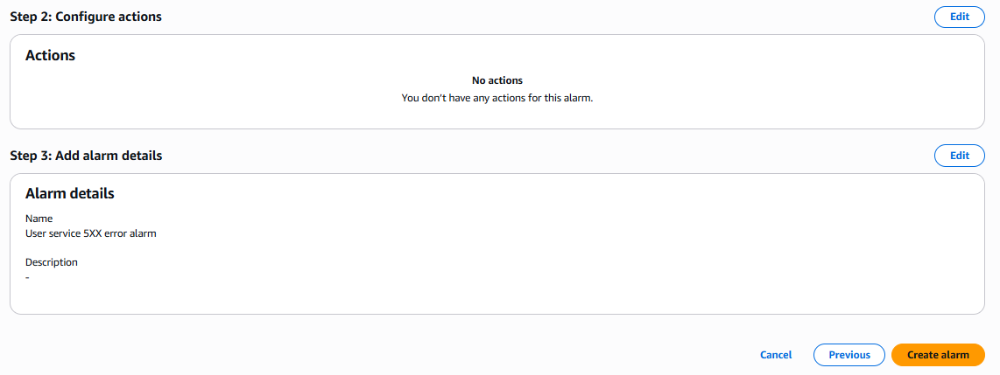
Sau khi cấu hình xong, bạn sẽ nhận được thông báo khi có sự cố xảy ra với API Gateway.

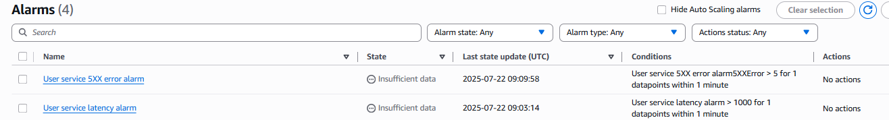