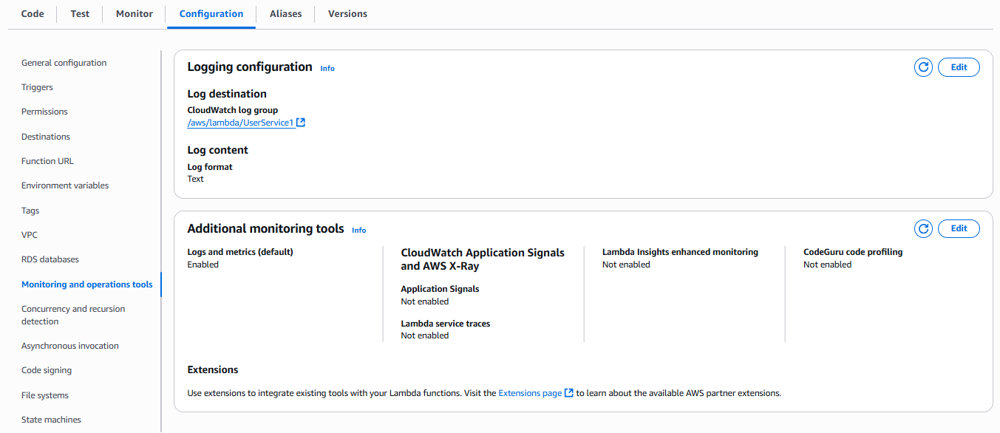
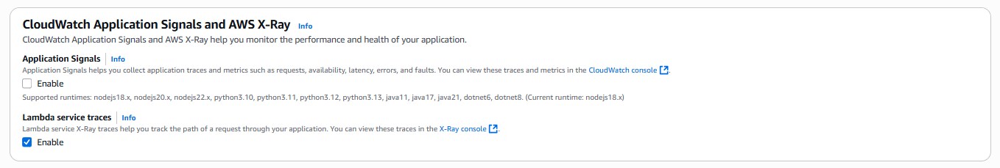

In this step, we will configure Lambda to log to CloudWatch and enable X-Ray tracing. This will help us monitor Lambda activities and receive detailed information about its performance.

## Set up Lambda to log to CloudWatch
- Access the AWS Management Console and open the Lambda service.
- Select the Lambda function you want to configure.
- In the **Configuration** section, select **Monitoring and operations tools**.
- Enable **Active tracing** to activate X-Ray tracing.
- Save the changes.

After configuration, Lambda will start logging to CloudWatch Logs. You can check these logs in the CloudWatch Logs service.

Here, we will configure Lambda functions to log to CloudWatch Logs. By default, Lambda functions are already configured to log to CloudWatch, but you can customize further if needed.

You just need to ensure that your Lambda functions have permission to log to CloudWatch. This is usually done through the IAM Role that you assign to Lambda functions, which was done in the [Create Lambda function](2.2-createlambda/) step.

Quick check of the Lambda function's IAM Role:
1. Access the AWS Management Console and open the IAM service.
2. Search for and select the IAM Role that you assigned to the Lambda function.
3. In the **Permissions** section, ensure that this IAM Role has the `AWSLambdaBasicExecutionRole` policy or similar to allow logging to CloudWatch.

Or in the **Configuration** section of the Lambda function, you can see the **Execution role** section, then access that role and check if it has the `AWSLambdaBasicExecutionRole` policy.

## Set up X-Ray tracing for Lambda
- In the **Configuration** section of the Lambda function, select **Monitoring and operations tools**.

- In the **X-Ray** section, you will see the option to enable X-Ray tracing.
- Enable **Active tracing** to activate X-Ray tracing.

- Save the changes.
After enabling X-Ray tracing, Lambda will send tracing data to AWS X-Ray. You can check these traces in the AWS X-Ray service to monitor the performance and issues of the Lambda function.