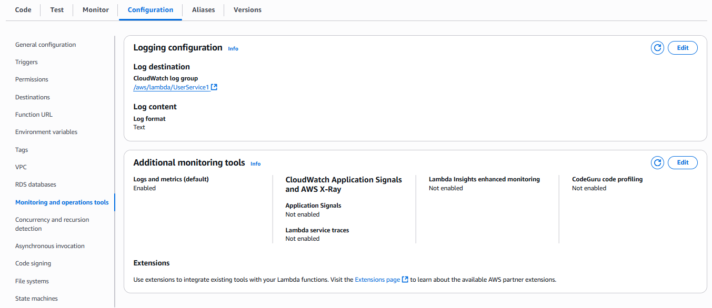

Ở bước này, chúng ta sẽ cấu hình Lambda để ghi log vào CloudWatch và bật X-Ray tracing. Việc này sẽ giúp chúng ta theo dõi các hoạt động của Lambda và nhận được thông tin chi tiết về hiệu suất của nó.

## Thiết lập Lambda để ghi log vào CloudWatch
- Truy cập vào AWS Management Console và mở dịch vụ Lambda.
- Chọn Lambda function mà bạn muốn cấu hình.
- Trong phần **Configuration**, chọn **Monitoring and operations tools**.
- Bật **Active tracing** để kích hoạt X-Ray tracing.
- Lưu các thay đổi.

Sau khi cấu hình xong, Lambda sẽ bắt đầu ghi lại các log vào CloudWatch Logs. Bạn có thể kiểm tra các log này trong dịch vụ CloudWatch Logs.

Ở đây, chúng ta sẽ cấu hình các Lambda functions để ghi log vào CloudWatch Logs. Mặc định, các Lambda functions đã được cấu hình để ghi log vào CloudWatch, nhưng bạn có thể tùy chỉnh thêm nếu cần.

Bạn chỉ cần đảm bảo rằng các Lambda functions của bạn có quyền ghi log vào CloudWatch. Điều này thường được thực hiện thông qua IAM Role mà bạn gán cho Lambda functions đã thực hiện ở bước [Tạo Lambda function](2.2-createlambda/)

Kiểm tra nhanh IAM Role của Lambda function:
1. Truy cập vào AWS Management Console và mở dịch vụ IAM.
2. Tìm kiếm và chọn IAM Role mà bạn đã gán cho Lambda function.
3. Trong phần **Permissions**, đảm bảo rằng IAM Role này có policy `AWSLambdaBasicExecutionRole` hoặc tương tự để cho phép ghi log vào CloudWatch.

Hoặc tại phần **Configuration** của Lambda function, bạn có thể thấy phần **Execution role** sau đó truy cập vào role đó và xem đã có policy `AWSLambdaBasicExecutionRole` chưa.

## Thiết lập X-Ray tracing cho Lambda
- Trong phần **Configuration** của Lambda function, chọn **Monitoring and operations tools**.

- Trong phần **X-Ray**, bạn sẽ thấy tùy chọn để bật X-Ray tracing.
- Bật **Active tracing** để kích hoạt X-Ray tracing.

- Lưu các thay đổi.
Sau khi bật X-Ray tracing, Lambda sẽ gửi dữ liệu tracing đến AWS X-Ray. Bạn có thể kiểm tra các trace này trong dịch vụ AWS X-Ray để theo dõi hiệu suất và các vấn đề của Lambda function.