In this step, we will deploy CodePipeline to automate the source code deployment process. CodePipeline will help us automate the steps from source code retrieval, building, testing to application deployment.

### Create CodePipeline

- Access the AWS Management Console and open the CodePipeline service.
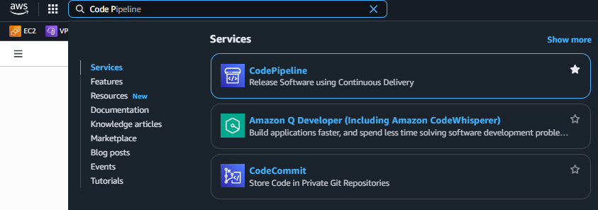
- Select **Create pipeline** to create a new pipeline.
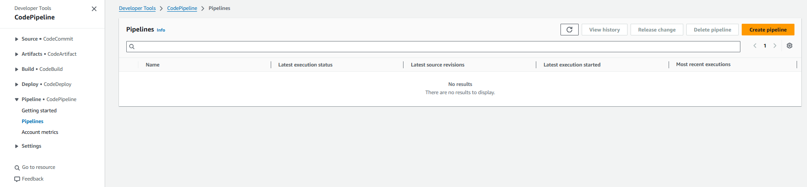

- In the **Choose creation option** section, select **Build custom pipeline**.
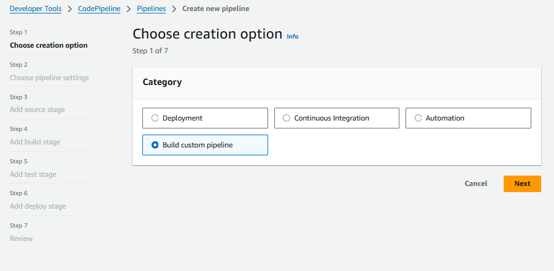
- Enter a name for the pipeline, for example: `UserServicePipeline`.
- **Execution mode**: select "Queue" to allow changes to be queued and processed sequentially.
- Select **New service role** to create a new IAM Role for CodePipeline or select **Existing service role** if you already have a suitable IAM Role.
Here, we will select **New service role** so that CodePipeline can automatically manage other AWS services. With the name `CodePipelineServiceRole`.
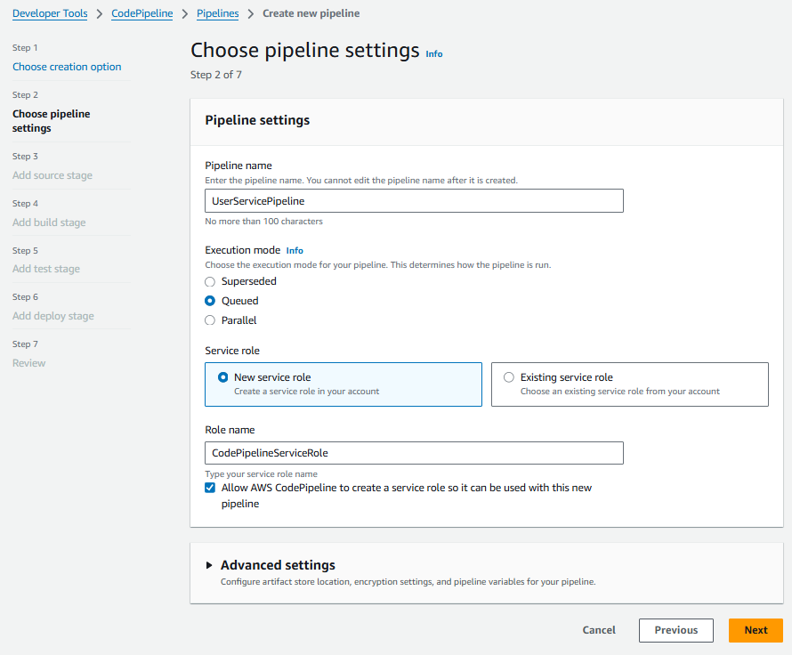
- Select **Next** to continue.

### Choose source code
- In the **Source provider** section, select **GitHub(via OAuth App)**.
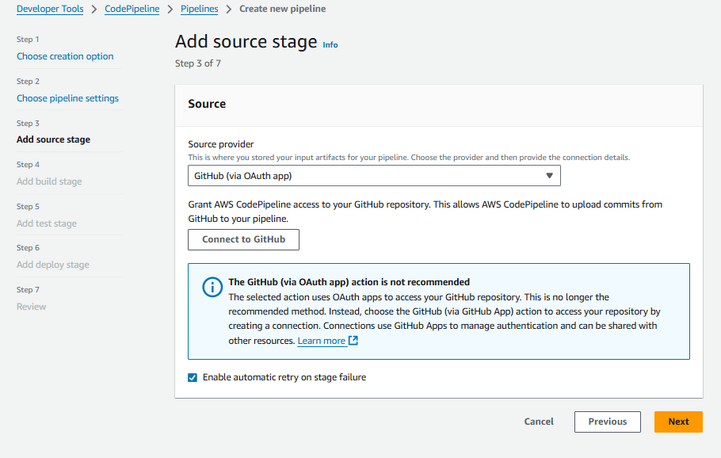
- Connect to your GitHub account by selecting **Connect to GitHub**. Here, you will need to log in to GitHub and grant permission for AWS CodePipeline to access your repository. After successfully connecting, you will see a list of your repositories.
- Select the repository containing your source code, for example: `UserService`. 
- Select the branch you want to track, for example: `main`.
- Select **Next** to continue.
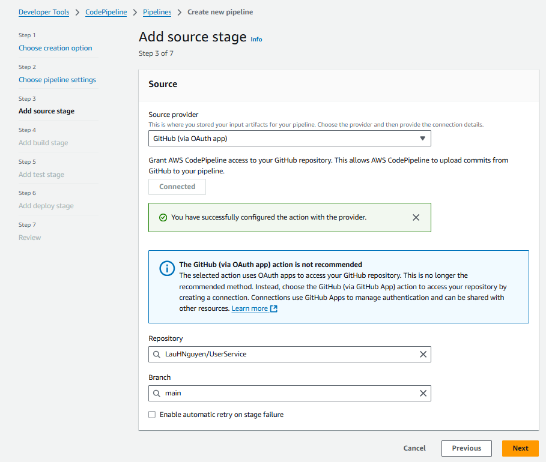

### Choose build service
- In the **Build provider** section, select **Other build providers** and select **AWS CodeBuild**.
- **Project name**: Enter the name of the CodeBuild project you created, for example: `UserServiceBuild`.
- Select **Next** to continue.
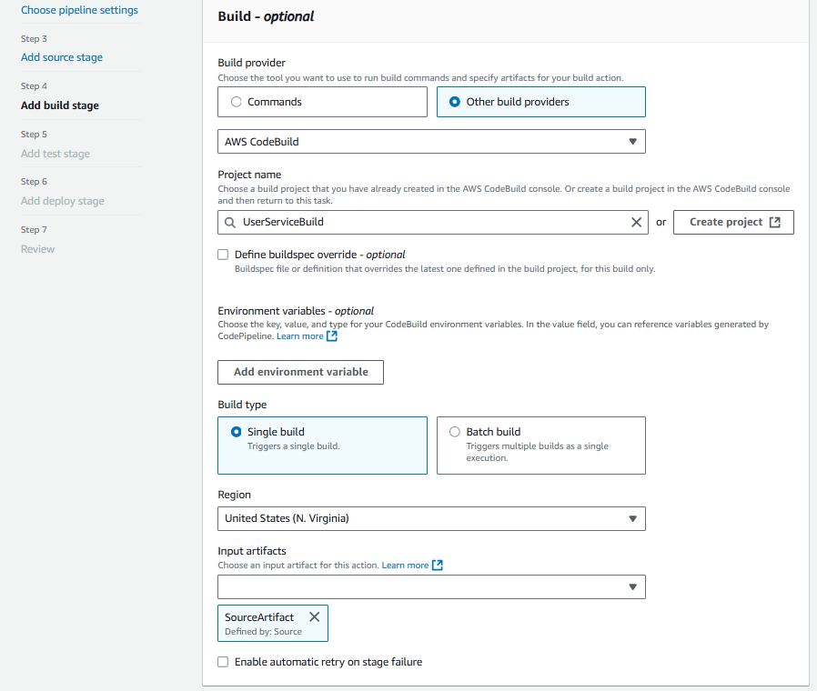

- In the **Test** section (if any), you can skip this step if you don't need automated testing. If needed, you can configure testing steps here.
- Select **Next** to continue.
- Similarly, in the **Deploy** section, you can configure deployment steps if needed. If you don't need automated deployment, you can skip this step.
- Select **Next** to continue.

### Review and create pipeline
- In the **Review** section, check the configured information. If everything is correct, select **Create pipeline** to create the pipeline.
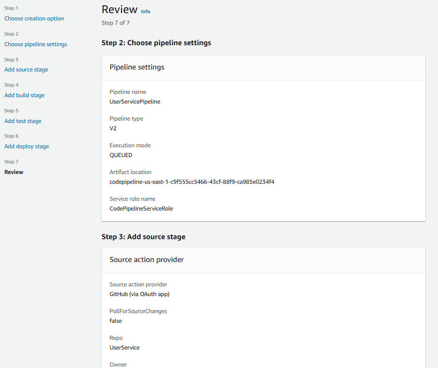
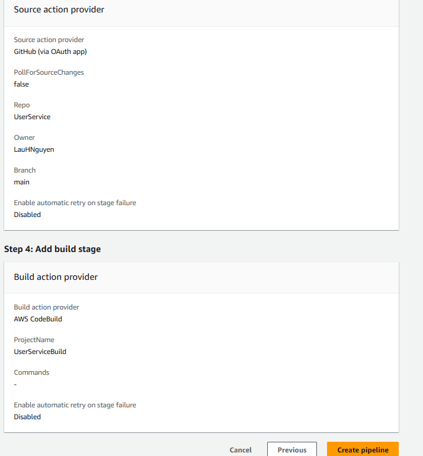

- After the pipeline is created, you will see the main CodePipeline interface with the configured steps.
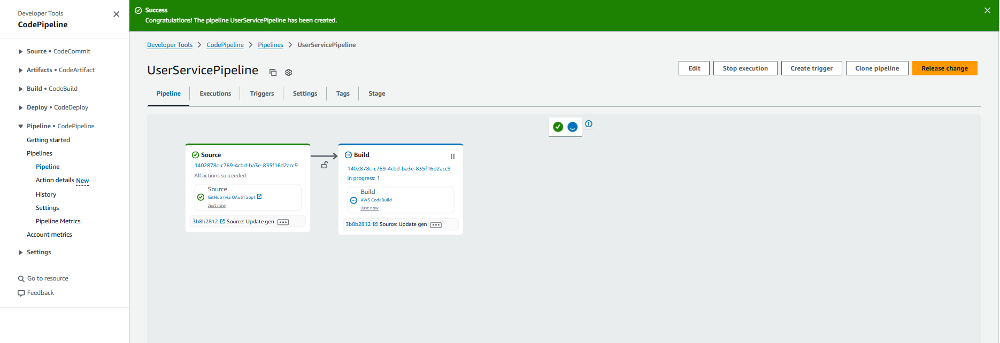
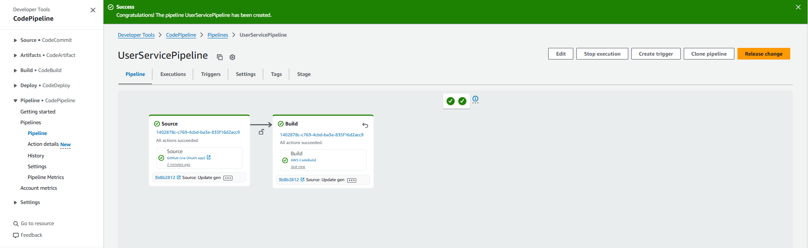

- After the pipeline is created, CodePipeline will automatically start the deployment process. You can monitor the progress of the pipeline in the CodePipeline interface. The pipeline will automatically retrieve source code from GitHub, build the application using CodeBuild, and deploy the application if you have configured the deployment step.

- Since here we only configured the source retrieval and build steps, the pipeline will only perform these steps. You can add testing and deployment steps if necessary.

- The pipeline will automatically start the deployment process when source code changes are pushed to the configured branch.
- You can monitor the progress of the pipeline in the CodePipeline interface. If errors occur, you will see error messages and can check details in the pipeline steps.

- This is how we deploy CodePipeline to automate the source code deployment process. With CodePipeline, we can easily manage and monitor the application development process, from source code retrieval, building, testing to application deployment automatically and efficiently.