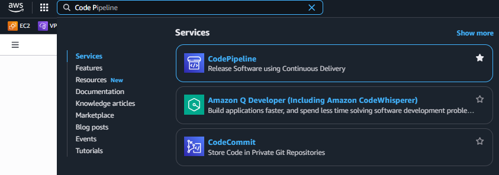
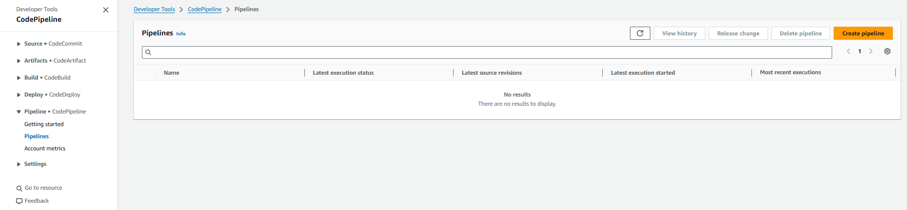
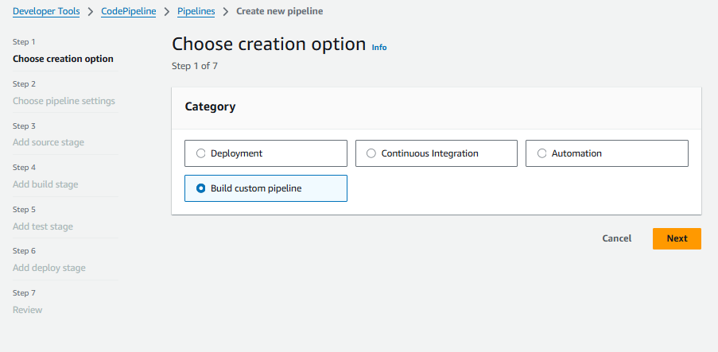
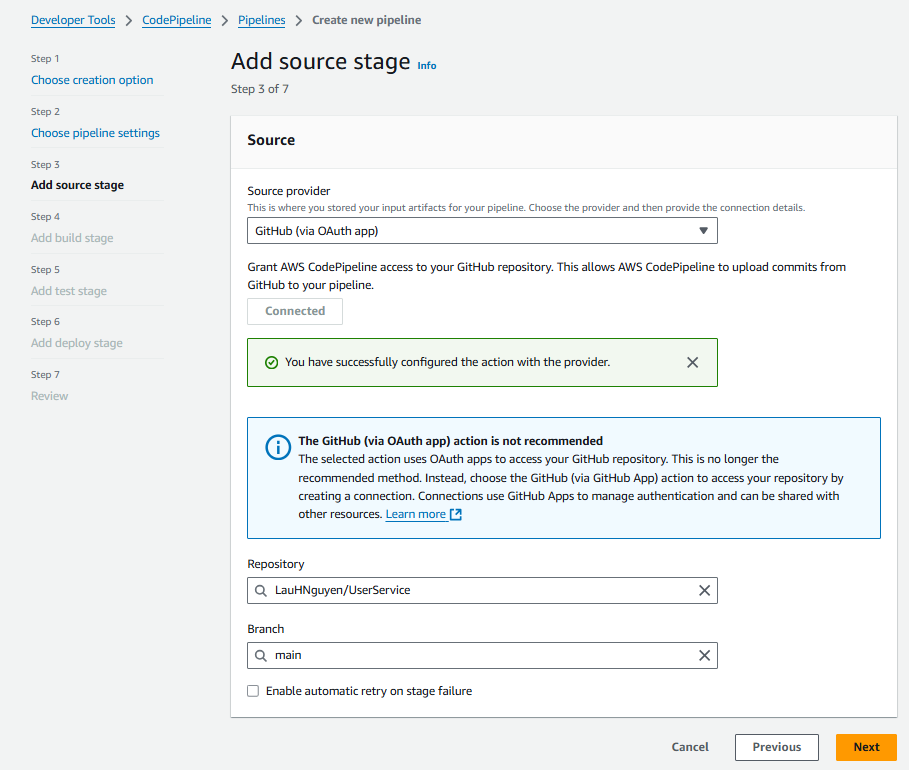
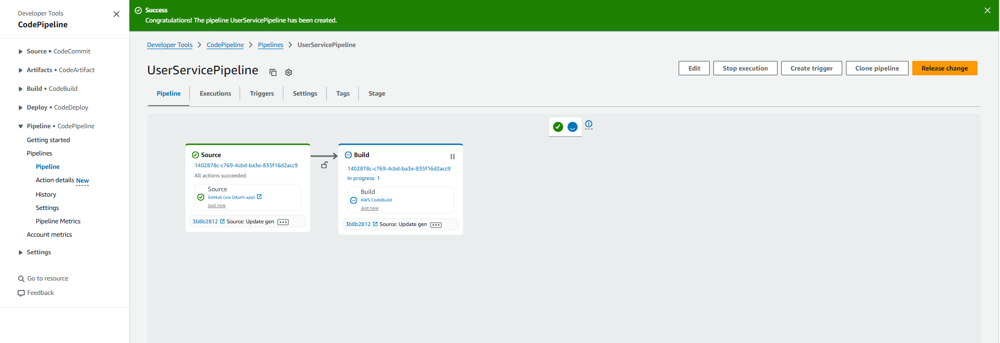

Ở bước này, chúng ta sẽ triển khai CodePipeline để tự động hóa quá trình triển khai mã nguồn. CodePipeline sẽ giúp chúng ta tự động hóa các bước từ việc lấy mã nguồn, xây dựng, kiểm tra đến triển khai ứng dụng.

### Tạo CodePipeline

- Truy cập vào AWS Management Console và mở dịch vụ CodePipeline.

- Chọn **Create pipeline** để tạo một pipeline mới.

- Trong phần **Choose creation option**, chọn **Build custom pipeline**.

- Nhập tên cho pipeline, ví dụ: `UserServicePipeline`.
- **Execution mode**: chọn "Queueue" để cho phép các thay đổi được xếp hàng và xử lý tuần tự.
- Chọn **New service role** để tạo một IAM Role mới cho CodePipeline hoặc chọn **Existing service role** nếu bạn đã có IAM Role phù hợp.
Ở đây, chúng ta sẽ chọn **New service role** để CodePipeline có thể tự động quản lý các dịch vụ AWS khác. Với tên là `CodePipelineServiceRole`.

- Chọn **Next** để tiếp tục.

### Chọn mã nguồn
- Trong phần **Source provider**, chọn **GitHub(via OAuth App)**.

- Kết nối với tài khoản GitHub của bạn bằng cách chọn **Connect to GitHub**. Ở đây, bạn sẽ cần đăng nhập vào GitHub và cấp quyền cho AWS CodePipeline truy cập vào repository của bạn. Sau khi kết nối thành công, bạn sẽ thấy danh sách các repository của mình.
- Chọn repository chứa mã nguồn của bạn, ví dụ: `UserService`. 
- Chọn nhánh mà bạn muốn theo dõi, ví dụ: `main`.
- Chọn **Next** để tiếp tục.

### Chọn dịch vụ xây dựng
- Trong phần **Build provider**, chọn **Other build providers** và chọn **AWS CodeBuild**.
- **Project name**: Nhập tên cho dự án CodeBuild đã tạo, ví dụ: `UserServiceBuild`.
- Chọn **Next** để tiếp tục.

- Ở phần **Test** (nếu có), bạn có thể bỏ qua bước này nếu không cần kiểm tra tự động. Nếu cần, bạn có thể cấu hình các bước kiểm tra tại đây.
- Chọn **Next** để tiếp tục.
- Tương tự, trong phần **Deploy**, bạn có thể cấu hình các bước triển khai nếu cần. Nếu không cần triển khai tự động, bạn có thể bỏ qua bước này.
- Chọn **Next** để tiếp tục.

### Xem lại và tạo pipeline
- Trong phần **Review**, kiểm tra lại các thông tin đã cấu hình. Nếu mọi thứ đúng, chọn **Create pipeline** để tạo pipeline.

- Sau khi pipeline được tạo, bạn sẽ thấy giao diện chính của CodePipeline với các bước đã cấu hình.

- Sau khi pipeline được tạo, CodePipeline sẽ tự động bắt đầu quá trình triển khai. Bạn có thể theo dõi tiến trình của pipeline trong giao diện CodePipeline. Pipeline sẽ tự động lấy mã nguồn từ GitHub, xây dựng ứng dụng bằng CodeBuild và triển khai ứng dụng nếu bạn đã cấu hình bước triển khai.

- Vì ở đây mình chỉ cấu hình bước lấy mã nguồn và xây dựng, nên pipeline sẽ chỉ thực hiện các bước này. Bạn có thể thêm các bước kiểm tra và triển khai nếu cần thiết.

- Pipeline sẽ tự động bắt đầu quá trình triển khai khi có thay đổi mã nguồn được đẩy lên nhánh đã cấu hình.
- Bạn có thể theo dõi tiến trình của pipeline trong giao diện CodePipeline. Nếu có lỗi xảy ra, bạn sẽ thấy thông báo lỗi và có thể kiểm tra chi tiết trong các bước của pipeline.

- Đây là cách chúng ta triển khai CodePipeline để tự động hóa quá trình triển khai mã nguồn. Với CodePipeline, chúng ta có thể dễ dàng quản lý và theo dõi quá trình phát triển ứng dụng, từ việc lấy mã nguồn, xây dựng, kiểm tra đến triển khai ứng dụng một cách tự động và hiệu quả.