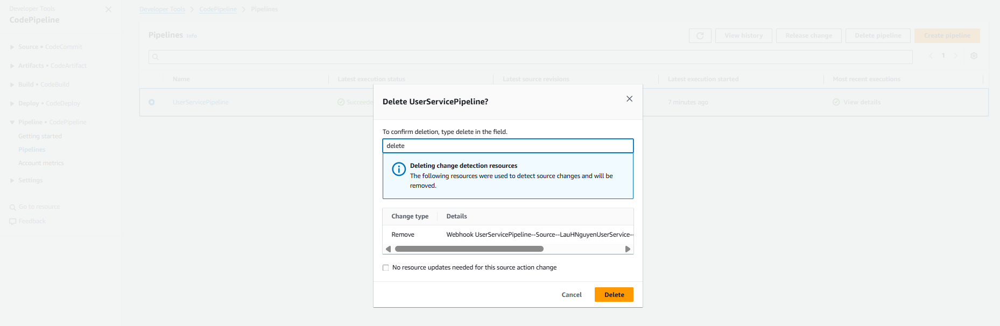
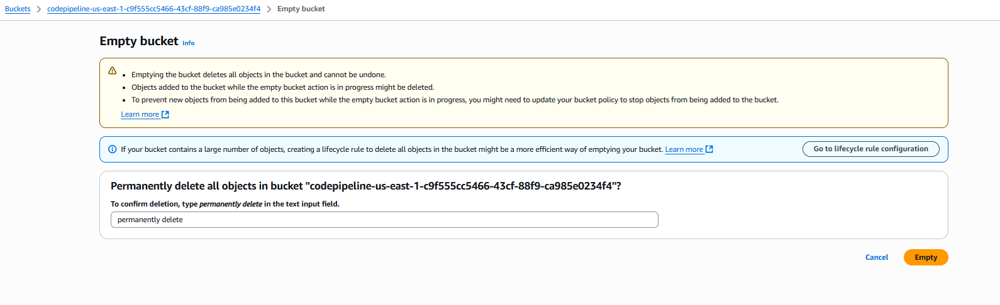
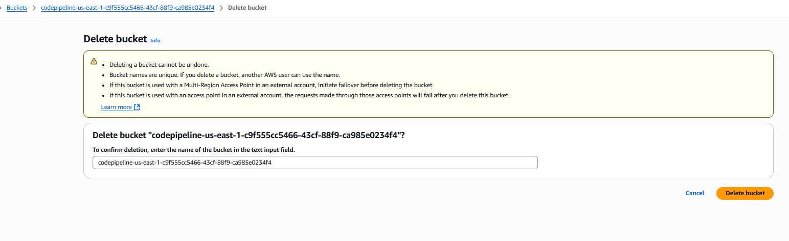
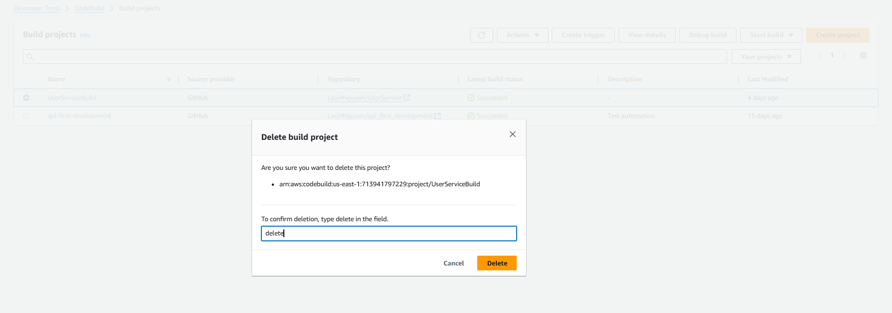
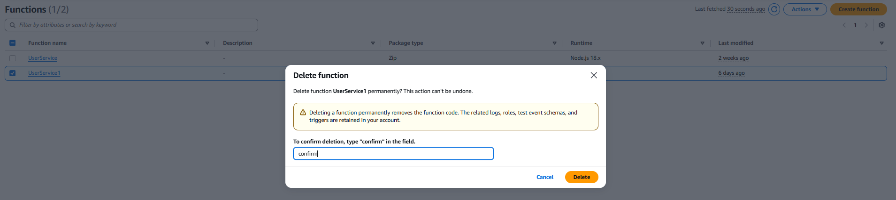
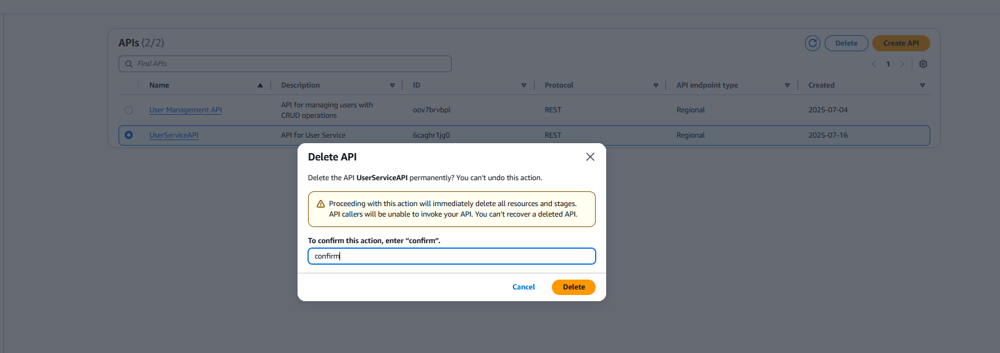
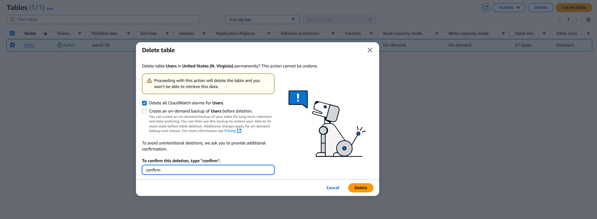

+++
title = "Clean Up Resources  "
date = 2021
weight = 6
chapter = false
pre = "<b>6. </b>"
+++

We will proceed with the following steps to delete the resources we created in this lab.

### Delete CodePipeline
- Access the [CodePipeline management console](https://console.aws.amazon.com/codesuite/codepipeline/home)
- Select the pipeline you want to delete.
- Click **Delete Pipeline** to delete the pipeline.
- Confirm the deletion by entering the pipeline name and clicking **Delete**.

### Delete S3 Bucket
Since Pipeline automatically creates an S3 bucket to store artifacts, we need to delete this bucket after deleting the pipeline.
- Access the [S3 management console](https://console.aws.amazon.com/s3/home)
- Select the bucket you created in this lab.
- First, you need to ensure that the S3 bucket no longer contains any data. You can delete the files in the bucket or delete the entire bucket.
- Click **Empty** to delete all files in the bucket.
- Confirm the deletion by entering the bucket name and clicking **Empty**.

- Next, click **Delete** to delete the bucket.
- Confirm the deletion by entering the bucket name and clicking **Delete**.

### Delete CodeBuild
- Access the [CodeBuild management console](https://console.aws.amazon.com/codesuite/codebuild/home)
- Select the CodeBuild project you want to delete.
- In the **Actions** section, click **Delete**.
- Confirm the deletion by entering the project name and clicking **Delete**.

### Delete IAM Role
- Access the [IAM management console](https://console.aws.amazon.com/iam/home)
- Select **Roles** from the left menu.
- Select the IAM Role you created in this lab to delete.
- Click **Delete** to delete the IAM Role.
- Confirm the deletion by entering the IAM Role name and clicking **Delete**.

### Delete Lambda Function
- Access the [Lambda management console](https://console.aws.amazon.com/lambda/home)
- Select the Lambda function you created in this lab.
- Click **Actions** and select **Delete**.
- Confirm the deletion by entering `confirm` and clicking **Delete**.

### Delete API Gateway
- Access the [API Gateway management console](https://console.aws.amazon.com/apigateway/home)
- Select the API you created in this lab.
- Click **Delete** in the top right corner.
- Confirm the deletion by entering `confirm` and clicking **Delete**.

### Delete DynamoDB Table
- Access the [DynamoDB management console](https://console.aws.amazon.com/dynamodb/home)
- Select the table you created in this lab.
- Click **Delete** to delete the table.
- Confirm the deletion by entering `confirm` and clicking **Delete**.
