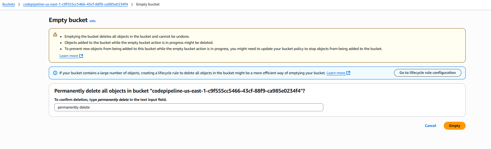
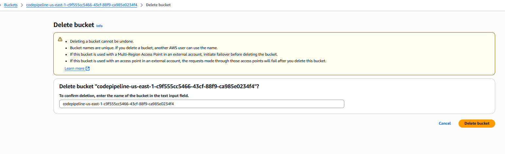
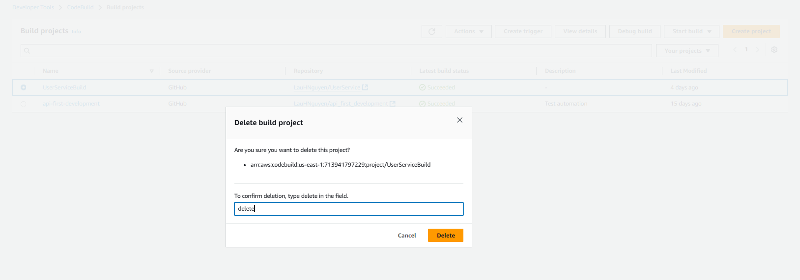
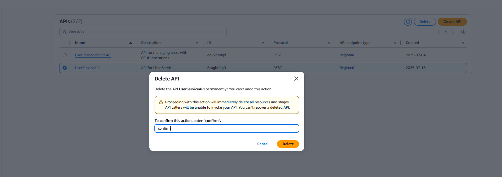

+++
title = "Dọn dẹp tài nguyên  "
date = 2021
weight = 6
chapter = false
pre = "<b>6. </b>"
+++

Chúng ta sẽ tiến hành các bước sau để xóa các tài nguyên chúng ta đã tạo trong bài thực hành này.

### Xóa CodePipeline
- Truy cập vào [giao diện quản trị dịch vụ CodePipeline](https://console.aws.amazon.com/codesuite/codepipeline/home)
- Chọn pipeline mà bạn muốn xóa.
- Nhấn **Delete Pipeline** để xóa pipeline.
- Xác nhận việc xóa bằng cách nhập tên pipeline và Nhấn **Delete**.

### Xóa S3 Bucket
Vì Pipeline tự động tạo ra một bucket S3 để lưu trữ các artifacts, nên chúng ta cần xóa bucket này sau khi đã xóa pipeline.
- Truy cập vào [giao diện quản trị dịch vụ S3](https://console.aws.amazon.com/s3/home)
- Chọn bucket mà bạn đã tạo trong bài lab này.
- Trước tiên, bạn cần đảm bảo rằng bucket S3 không còn chứa bất kỳ dữ liệu nào. Bạn có thể xóa các tệp trong bucket hoặc xóa toàn bộ bucket.
- Nhấn **Empty** để xóa tất cả các tệp trong bucket.
- Xác nhận việc xóa bằng cách nhập tên bucket và Nhấn **Empty**.

- Tiếp theo nhấn **Delete** để xóa bucket.
- Xác nhận việc xóa bằng cách nhập tên bucket và Nhấn **Delete**.

### Xóa CodeBuild
- Truy cập vào [giao diện quản trị dịch vụ CodeBuild](https://console.aws.amazon.com/codesuite/codebuild/home)
- Chọn dự án CodeBuild mà bạn muốn xóa.
- Ở phần **Actions**, Nhấn **Delete**.
- Xác nhận việc xóa bằng cách nhập tên dự án và Nhấn **Delete**.

### Xóa IAM Role
- Truy cập vào [giao diện quản trị dịch vụ IAM](https://console.aws.amazon.com/iam/home)
- Chọn **Roles** từ menu bên trái.
- Chọn IAM Role mà bạn đã tạo trong bài lab này để xóa.
- Nhấn **Delete** để xóa IAM Role.
- Xác nhận việc xóa bằng cách nhập tên IAM Role và Nhấn **Delete**.

### Xóa Lambda Function
- Truy cập vào [giao diện quản trị dịch vụ Lambda](https://console.aws.amazon.com/lambda/home)
- Chọn hàm Lambda mà bạn đã tạo trong bài lab này.
- Nhấn **Actions** và chọn **Delete**.
- Xác nhận việc xóa bằng cách nhập `confirm` và Nhấn **Delete**.

### Xóa API Gateway
- Truy cập vào [giao diện quản trị dịch vụ API Gateway](https://console.aws.amazon.com/apigateway/home)
- Chọn API mà bạn đã tạo trong bài lab này.
- Nhấn **Delete** ở góc trên bên phải.
- Xác nhận việc xóa bằng cách nhập `confirm` và Nhấn **Delete**.

### Xóa DynamoDB Table
- Truy cập vào [giao diện quản trị dịch vụ DynamoDB](https://console.aws.amazon.com/dynamodb/home)
- Chọn bảng mà bạn đã tạo trong bài lab này.
- Nhấn **Delete** để xóa bảng.
- Xác nhận việc xóa bằng cách nhập `confirm` và Nhấn **Delete**.
