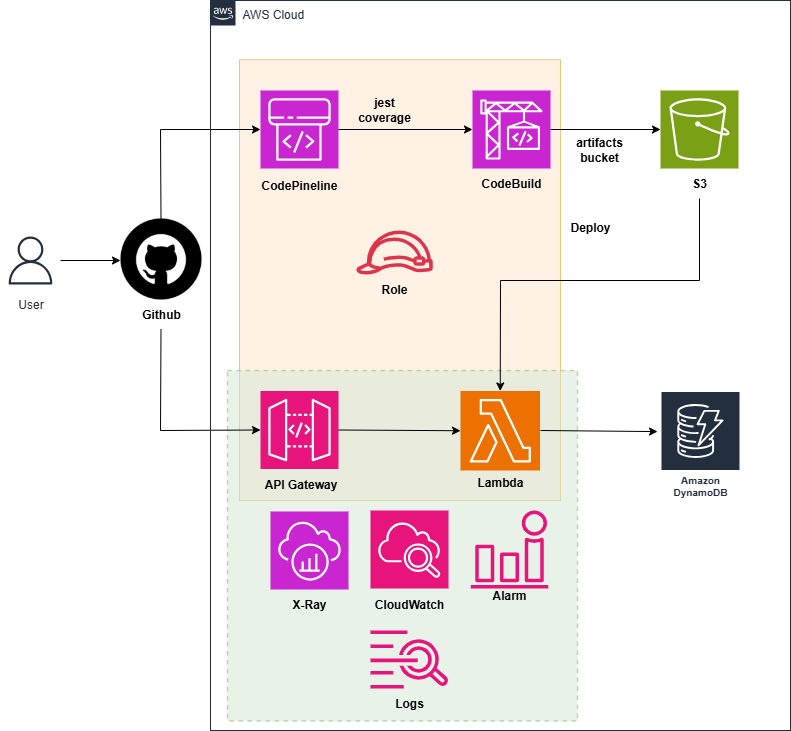

# API-First Development with OpenAPI and Code Generation

### Overall
 In this lab, you will learn the basic and practices of API Gateway, Lambda functions, CodeBuild, and CodePipeline. Practice deploying APIs with OpenAPI as well as automating the deployment process and testing code after pushing it to github.

### Content
 1. [Introduction ](1-introduce/)
 2. [Preparation](2-prerequiste/)
 3. [Deploy CodeBuild](3-DeployCodeBuild/)
 4. [Monitoring and Alerts](4-Monitoring/)
 5. [Deploy CodePipeline](5-DeployCodePipeline/)
 6. [Clean up resources](6-cleanup/)
