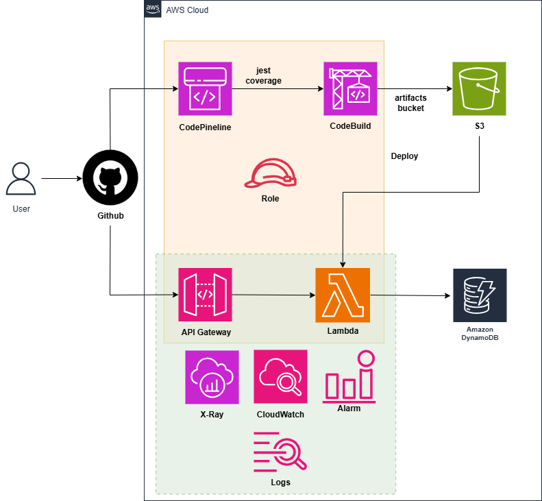

# Phát triển API-First với OpenAPI và Code Generation

### Tổng quan

 Trong bài lab này, bạn sẽ tìm hiểu các khái niệm cơ bản và thực hành về API Gateway, Lambda function, CodeBuild và CodePipeline. Thực hành triển khai API với OpenAPI cũng như việc tự động hóa quá trình triển khai và kiểm tra code sau khi đẩy lên github.

 
### Nội dung

 1. [Giới thiệu](1-introduce/)
 2. [Các bước chuẩn bị](2-Prerequiste/)
 3. [Triển khai CodeBuild](3-DeployCodeBuild/)
 4. [Giám sát và cảnh báo](4-Monitoring/)
 5. [Triển khai CodePipeline](5-DeployCodePipeline/)
 6. [Dọn dẹp tài nguyên](6-cleanup/)
